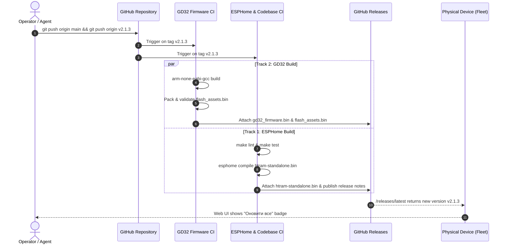

# HTRAM Release Engineering & Publishing Guide

This guide establishes the authoritative, step-by-step procedure for cutting, verifying, and publishing HTRAM firmware releases on GitHub. Following this process ensures releases are automatically compiled by GitHub Actions, populated with all required dual-chip binaries and graphic assets, and made immediately available to users through the web UI 1-click update.

---

## 1. Release Architecture & Component Coordination

HTRAM is a dual-microcontroller system with external SPI Flash storage. Every public release synchronizes three distinct components:

```
+-----------------------------------------------------------------------------------+
| GITHUB RELEASE: vX.Y.Z (Cloud Artifact Repository)                                |
|                                                                                   |
| 1. htram-standalone.bin      - ESP32 Application Image (ESPHome)                  |
| 2. gd32_firmware.bin         - GD32F150 Coprocessor Firmware (ARM Cortex-M3)      |
| 3. flash_assets.bin          - 1-Bit Vector Mask Assets Container (SPI Flash)     |
| 4. *.md5, *.sha256           - Integrity and authenticity checksums               |
+-----------------------------------------------------------------------------------+
                                         │
                                         │ HTTPS Download (Periodic check / 1-click)
                                         ▼
+-----------------------------------------------------------------------------------+
| PHYSICAL FLEET DEVICE (e.g. 192.168.0.78 / office)                                |
|                                                                                   |
| 1. Auto-check: ESP32 queries releases/latest every 60 min                         |
| 2. Web UI notification: "Доступне оновлення: vX.Y.Z"                              |
| 3. User action: "Оновити все" (Full 1-Click Update)                               |
|    - Step A: Auto-persists active Wi-Fi credentials to NVS                        |
|    - Step B: Stages gd32_firmware.bin into SPI Flash Block 3 & GD32 reboots       |
|    - Step C: GD32 displays fallback diagnostics screen during blackout            |
|    - Step D: Validates and writes flash_assets.bin if updated                     |
|    - Step E: Streams htram-standalone.bin to inactive ESP32 OTA partition         |
|    - Step F: ESP32 reboots into new firmware, restores Wi-Fi & confirms boot      |
+-----------------------------------------------------------------------------------+
```

### Component Versioning Rules
| Component | Source Location | Version Format | How It Is Tracked |
| :--- | :--- | :--- | :--- |
| **ESPHome App** | `esphome/htram-core.yaml`<br>`esphome/htram.yaml` | SemVer `2.X.Y` | `firmware_version: "2.X.Y"` |
| **GD32 Coprocessor** | `firmware/gd32/inc/protocol.h` | Hex SemVer `0x0132` | `#define GD32_FW_VERSION 0x0132 /* v1.3.2 */` |
| **Graphic Assets** | `firmware/gd32/assets/` | CRC32 Container | `make pack-assets validate-assets` |

---

## 2. Pre-Release Checklist (Step-by-Step)

### Step 1: Version Bumps
When preparing a release, increment the versions according to the scope of changes:

1. **ESPHome Firmware**:
   - `esphome/htram-core.yaml`:
     ```yaml
     substitutions:
       firmware_version: "2.1.3"
     ```
   - `esphome/htram.yaml`:
     ```yaml
     substitutions:
       firmware_version: "2.1.3"
     ```

2. **GD32 Coprocessor Firmware** (if `firmware/gd32/` changed):
   - `firmware/gd32/inc/protocol.h`:
     ```c
     #define GD32_FW_VERSION             0x0132 /* v1.3.2 */
     ```
     *(Note: Major byte `>> 8`, Minor nibble `>> 4`, Patch nibble `& 0x0F`)*

3. **Graphic Assets Container** (if SVGs/icons in `firmware/gd32/assets/` changed):
   ```bash
   make pack-assets validate-assets
   ```

---

### Step 2: Release Notes Documentation
Create a detailed release notes markdown file in `docs/RELEASE_NOTES_v<version>.md`:

```markdown
# HTRAM Release v2.1.3

## Огляд релізу (Release Overview)
Brief 2-3 sentence summary of the release purpose in Ukrainian.

## Основні зміни (Key Features & Improvements)
### 1. Title of Feature / Fix
- Bulleted description of problem, root cause, and solution.

### 2. Підвищення версій компонентів
- **ESPHome Firmware**: `v2.1.3`
- **GD32 Coprocessor Firmware**: `v1.3.2` (`0x0132`)
- **Graphic Assets Container**: 47 активних асетів

## Хеш-суми бінарних файлів (Artifact Checksums)
Automated by GitHub Actions CI.
```

---

### Step 3: Local Verification & Pre-flight Testing
Before committing to `main` or pushing any tag, execute the full local validation:

```bash
# 1. Compile GD32 and assert Flash (<64KB) and SRAM (<8KB) budgets:
make build-gd32

# 2. Run all GD32 C99 unit tests (protocol, sensors, HAL, SPI Flash):
make test-gd32

# 3. Run all linters (fanalyzer, yamllint, ruff, mypy):
make lint

# 4. Run the complete test suite (Unit, Tools, ESPHome configs, E2E Pytest):
make test
```
**CRITICAL**: Every check MUST pass with zero failures. Never tag a commit that fails any test.

---

### Step 4: Branching, Merging & Tagging

1. **Commit changes on the feature or fix branch**:
   ```bash
   git add esphome/htram-core.yaml esphome/htram.yaml firmware/gd32/inc/protocol.h docs/RELEASE_NOTES_v2.1.3.md
   git commit -m "feat(scope): concise description of changes (v2.1.3)"
   ```

2. **Merge cleanly into `main` with `--no-ff`**:
   ```bash
   git checkout main
   git merge --no-ff -m "Merge branch 'feature/my-feature' into main: v2.1.3 release" feature/my-feature
   ```

3. **Create an annotated Git tag**:
   ```bash
   git tag -a v2.1.3 -m "Release v2.1.3: Summary of the release"
   ```

4. **Push `main` and the tag to GitHub**:
   ```bash
   git push origin main && git push origin v2.1.3
   ```

---

## 3. Automated GitHub Actions CI & Publishing

When the tag `v*` is pushed, two parallel GitHub workflows trigger automatically:



### Monitoring the Build
Monitor build progress using the Python API script:
```bash
python3 -c "
import urllib.request, json
url = 'https://api.github.com/repos/reidMaks/htram-esphome/actions/runs?per_page=4'
req = urllib.request.Request(url, headers={'User-Agent': 'Mozilla/5.0'})
with urllib.request.urlopen(req) as resp:
    data = json.loads(resp.read().decode())
    for r in data.get('workflow_runs', []):
        print(f\"{r['name']} | {r['head_branch']} | {r['status']} | {r['conclusion']}\")
"
```

### Verifying Release Artifacts
Once both workflows finish with `conclusion: success`, verify the release assets:
```bash
python3 -c "
import urllib.request, json
url = 'https://api.github.com/repos/reidMaks/htram-esphome/releases/tags/v2.1.3'
req = urllib.request.Request(url, headers={'User-Agent': 'Mozilla/5.0'})
with urllib.request.urlopen(req) as resp:
    data = json.loads(resp.read().decode())
    print('Release:', data['name'])
    for a in data.get('assets', []):
        print(f\"  {a['name']}: {a['size']} bytes\")
"
```

Mandatory artifacts that MUST be present:
- `htram-standalone.bin` (~1.4 MB) + checksums (`.md5`, `.sha256`)
- `gd32_firmware.bin` (~16 KB) + checksums (`.md5`, `.sha256`)
- `flash_assets.bin` (~20 KB) + checksums (`.md5`, `.sha256`)

---

## 4. End-User 1-Click Update Experience

Once the GitHub release is published:
1. **Discovery**: Within 1 hour (or immediately upon clicking "Перевірити оновлення" in Web UI), the device detects the new release.
2. **Notification**: The top navigation and system status card show:
   - "Доступне оновлення: **v2.1.3**"
   - Link to release notes on GitHub.
   - Button: **«Оновити все»**.
3. **Execution**:
   - The user clicks **«Оновити все»**.
   - ESP32 saves active Wi-Fi credentials to NVS partition `htram_wifi_perm_v1`.
   - ESP32 streams `gd32_firmware.bin` to SPI Flash Staging Slot (`0x030000`).
   - GD32 flashes itself and displays the readable diagnostic fallback screen.
   - ESP32 downloads `htram-standalone.bin`, verifies MD5, flashes to inactive partition, and reboots.
   - ESP32 boots up, restores Wi-Fi from NVS, takes over the display, and issues `CMD_TYPE_FLASH_CONFIRM_BOOT`.

---

## 5. Fleet Verification Post-Release

Verify that fleet devices successfully updated and are healthy:
```bash
# Query live telemetry and firmware versions across all fleet devices:
make status-all

# Or check specific node:
uv run python3 tools/device.py office status
```
Look for:
- `Firmware Version: 2.1.3`
- `GD32 Firmware: 1.3.2 ...`
- `IP Address: 192.168.0.78` (valid IP on home subnet, NOT fallback AP)
