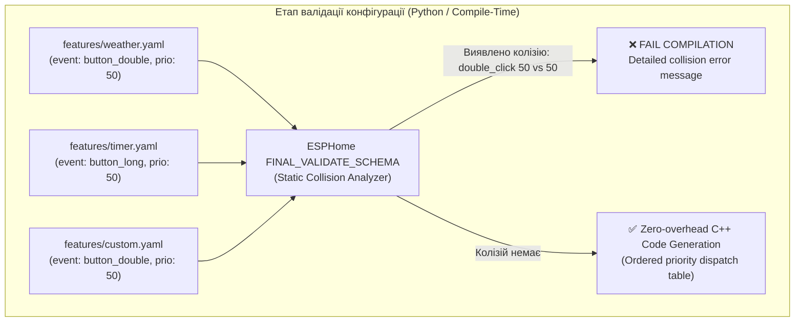
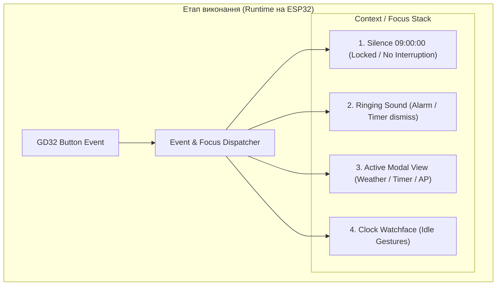

# План архітектурної реорганізації та фреймворку апаратного арбітражу для HTRAM

## Опис цілі та контекст

Проєкт **HTRAM** еволюціонував від монолітної прошивки годинника воєнного часу до модульної системи із пакетами розширень (`features/alarm.yaml`, `features/weather.yaml`, `features/timer.yaml`, `features/diagnostics.yaml`).
Проте дві критичні функції — **Хвилина мовчання** (09:00, метроном, гімн, герб Тризуб) та **Повітряна тривога** (`jaam_ws`, типи загроз, піктограми, перефарбовування цифр) — досі глибоко зашиті в `esphome/htram-core.yaml`.

Це призводить до трьох ключових архітектурних проблем:
1. **Жорстке монолітне зв'язування (Tight Coupling)**: Користувач не може вимкнути повітряну тривогу або хвилину мовчання для окремої кімнати (наприклад, спальня дитини чи кабінет) або для пристроїв за межами України/без сервера JAAM. Якщо сервера JAAM немає в мережі, екран через 30 секунд назавжди показує значок втрати зв'язку (`ui_nolink`).
2. **Перехресні залежності між пакетами**: `alarm.yaml` напряму звертається до `id(alert_active)`, а `timer.yaml` напряму читає `id(silence_active)`. Якщо вилучити ці змінні з ядра, інші пакети розсипаються на етапі компіляції.
3. **Апаратні конфлікти ресурсів (Hardware Resource Race & Starvation)**:
   - **Аудіо (Buzzer / RTTTL)**: Бузер GD32 має один звуковий канал без черги. Будь-який `send_beep` чи `play_rtttl` негайно збиває поточну мелодію. Метроном хвилини мовчання обриває звук тривоги; зупинка будильника (`alarm_stop`) заглушає будь-яку іншу активну мелодію.
   - **Фізична кнопка**: Обробка жестів через послідовний ланцюжок `!extend handle_feature_button` призводить до «голодування» жестів: наприклад, `timer.yaml` у стані спокою перехоплює **всі** одинарні кліки (`single`), не даючи їм дійти до інших функцій, а `weather.yaml` перехоплює подвійний клік (`double`), блокуючи показ мережевої IP-адреси з ядра.
   - **Екран та статусний слот**: Віджети тривоги (`ui_alert`) та дзвіночка будильника (`ui_bell`) жорстко розміщені на однакових координатах `(74, -26)`. Екрани погоди, таймера та оверлеїв самостійно ховають/показують цифри годинника без єдиної моделі станів.
   - **Світлодіоди**: Під час хвилини мовчання світлодіоди повинні мовчати, але чергове вимірювання сенсора CO2 через `refresh_leds` запалює зелений/жовтий світлофор посеред скорботи.

---

## Архітектурний аналіз: Децентралізований фреймворк та статичний аналіз колізій

Головний принцип нового дизайну:
> **Кожна функція (feature) самостійно декларує, які апаратні події вона слухає, в якому контексті та з яким пріоритетом. Ядро не знає про конкретні фічі — воно надає шину подій та арбітри ресурсів. Будь-які колізії аналізуються статично на етапі збірки через Python-схему ESPHome і негайно зупиняють (fail) компіляцію з детальним описом конфлікту.**





---

## Ключові принципи та узгоджені рішення

> [!IMPORTANT]
> **1. Неприпустимість переривання Хвилини мовчання о 09:00:**
> - Хвилина мовчання, що запускається автоматично щодня о 09:00:00, є священним меморіальним актом.
> - **Усі кліки кнопки о 09:00 повністю ігноруються** (поглинаються ядром). Ні метроном, ні гімн, ні екран із гербом не можуть бути скасовані чи перервані кнопкою.
> - **Виняток (Діагностика)**: Лише коли Хвилина мовчання викликана вручну для перевірки через тестову сутність `test_silence_button` (діагностика розробника), дозволяється перервати її кнопкою або викликом сервісу, щоб не чекати 75 секунд під час налагодження.

> [!IMPORTANT]
> **2. Децентралізоване оголошення слухачів подій у фічах:**
> - Замість жорсткого зашивання жестів у ядрі чи неконтрольованого ланцюжка `!extend`, кожна функція декларує свої наміри через єдину декларативну схему:
>   ```yaml
>   htram_event:
>     - event: button_double
>       context: clock
>       priority: 50
>       name: weather_toggle
>       on_trigger:
>         - script.execute: show_weather
>   ```
> - Події можуть мати контекст:
>   - `clock` — звичайний циферблат у стані спокою.
>   - `modal` — коли саме ця фіча володіє екраном.
>   - `ringing` — коли звучить будильник/таймер.
>   - `any` — глобальна системна подія.

> [!WARNING]
> **3. Статичний аналіз колізій на етапі компіляції (Compile-Time Collision Detection):**
> - Реалізується в `esphome/custom_components/htram_gd32` (або `htram_events`) через механізм `FINAL_VALIDATE_SCHEMA` в Python.
> - Коли ESPHome об'єднує всі YAML-пакети, валідатор збирає всі оголошені слухачі подій:
>   - Якщо дві різні фічі реєструють обробник на **однакову пару `(event, context)` з однаковим пріоритетом** — збірка негайно переривається з помилкою `cv.Invalid`:
>     ```
>     [ERROR] HTRAM Hardware Event Collision Detected:
>       Event: 'button_double' in Context: 'clock'
>       Conflict between:
>         - Handler 'weather_toggle' from features/weather.yaml (priority 50)
>         - Handler 'network_info' from htram-core.yaml (priority 50)
>       Resolution: Adjust priority or assign a different gesture in your package configuration.
>     ```
>   - Якщо пріоритети різні, подія передається від вищого пріоритету до нижчого за принципом ланцюга відповідальності (якщо вищий обробник повернув `true`, нижчий не викликається).

---

## Детальний опис компонентів фреймворку

### 1. Event & Input Dispatcher (Диспетчер подій та статичний валідатор)

#### Типи подій (`event`):
- `button_single` — одинарний клік;
- `button_double` — подвійний клік;
- `button_triple` — потрійний клік;
- `button_long` — довге натискання (>1.5 с);
- `sound_dismiss` — дія вимкнення/відкладення звуку;
- `screen_close` — дія закриття активного модального вікна;
- `state_change` — зміна зовнішнього стану (наприклад, зміна тривоги).

#### Контексти виконання (`context`):
1. `silence_sacred` — активна автоматична хвилина мовчання 09:00:00 (усі жести кнопки блокуються).
2. `ringing` — активний виклик зі звуком (будильник, таймер). Будь-який клік спочатку направляється на вимкнення звуку.
3. `modal` — відкритий повноекранний інтерфейс фічі (погода, таймер, AP). Події йдуть безпосередньо поточному власнику екрана.
4. `clock` — циферблат годинника у стані спокою. Стандартні жести керування.

---

### 2. Sound Manager (Арбітр звуку та мелодій)

GD32 має один фізичний канал відтворення звуку (команди `CMD_BEEP`, `CMD_PLAY_MELODY`, `CMD_STOP`).
Кожен запит на відтворення звуку має вказувати пріоритет та ідентифікатор власника:

| Рівень (`prio`) | Константа | Власники |
|---|---|---|
| `0` | `SOUND_PRIO_NONE` | Тиша |
| `10` | `SOUND_PRIO_UI` | Клацання інтерфейсу, тестовий біп |
| `20` | `SOUND_PRIO_NOTIFICATION` | Завершення таймера, сигнал OTA, метроном 09:00 |
| `30` | `SOUND_PRIO_ALARM` | Будильник (`alarm_ring`) |
| `40` | `SOUND_PRIO_ALERT` | Сирена повітряної тривоги (`alert_start_rtttl`) |

**Правила**:
- `sound_play(prio, owner, ...)`: витісняє поточний звук лише якщо `prio >= current_prio`.
- `sound_stop(owner)`: зупиняє звук **виключно** якщо виклик надійшов від поточного власника (`owner == current_owner`) або має абсолютний пріоритет.
- Сирена тривоги (`prio: 40`) перериває будильник (`prio: 30`) або метроном (`prio: 20`).
- Метроном (`prio: 20`) **не може** збити сирену тривоги (`prio: 40`).
- Зупинка будильника (`sound_stop("alarm")`) не збиває тривогу, якщо в цей час лунає сирена.

---

### 3. Screen & Modal State Arbiter (Диспетчер екрана)

Централізована машина станів екрана:
- `SCREEN_CLOCK` (0) — циферблат;
- `SCREEN_MODAL_VIEW` (1) — екран погоди (авто-вихід через 60 с або за кліком);
- `SCREEN_MODAL_TOOL` (2) — екран таймера (налаштування/зворотний відлік);
- `SCREEN_OVERLAY` (3) — інфо-екран IP / MAC (6 с);
- `SCREEN_SILENCE` (4) — меморіальний екран із Тризубом;
- `SCREEN_AP` (5) — точка доступу WiFi (Captive portal).

**Життєвий цикл**:
- Запит: `screen_request(mode, owner)`. Якщо `mode >= current_mode`, попередній екран отримує подію `on_screen_exit`, цифри годинника ховаються, новий екран отримує `on_screen_enter`.
- Звільнення: `screen_release(owner)` повертає циферблат та відновлює цифри годинника.

---

### 4. Status Slot Icon Arbiter (Диспетчер верхньої іконки)

Координати `(74, -26)` єдині для статусних піктограм:
- Пріоритет 1: `ui_alert` (Повітряна тривога).
- Пріоритет 2: `ui_bell` (Будильник зведений / відкладений).
- Пріоритет 3: `ui_timer_icon` (Таймер працює у фоні).
Фічі не звертаються до чужих змінних — кожна фіча виставляє прапорець свого стану, а диспетчер слота показує одну піктограму з найвищим пріоритетом.

---

### 5. LED Manager (Арбітр світлодіодів)

Пріоритети:
1. `OTA` — білий колір `(1, 1, 1, 1)`.
2. `SILENCE` — повна темрява `(0, 0, 0, 0)`. Скрипт CO2 `refresh_leds` блокується.
3. `ALERT` — індикація тривоги (якщо увімкнено).
4. `CO2` — стандартний світлофор якості повітря.

---

## Пропоновані зміни по файлах

### [Component 1] Ядро: `esphome/htram-core.yaml` та `custom_components/htram_gd32`

#### [MODIFY] `esphome/custom_components/htram_gd32/`
- Додати валідацію `FINAL_VALIDATE_SCHEMA` в `__init__.py` для перевірки колізій `htram_event`.
- При виявленні двох обробників з однаковим `(event, context, priority)` — викликати `raise cv.Invalid(...)` з детальним описом колізії.
- Автоматично згенерувати C++ таблицю диспетчеризації подій.

#### [MODIFY] `esphome/htram-core.yaml`
- Видалити `jaam_ws`, маски тривог, `ui_alert`, `ui_nolink`, змінні тривоги.
- Видалити змінні та скрипти хвилини мовчання, `silence_enabled`, `test_silence_button`.
- Додати реалізацію арбітрів: `sound_manager`, `screen_manager`, `status_icon_manager`, `led_manager`.
- Задекларувати базові події ядра через `htram_event`:
  - `event: button_triple, context: clock, priority: 10` -> показ IP-адреси.
  - `event: button_single, context: clock, priority: 10` -> перемикання слота.

---

### [Component 2] Хвилина мовчання: `esphome/features/silence.yaml`

#### [NEW] `esphome/features/silence.yaml`
- Повністю автономний пакет.
- Щоденний тригер о 09:00:00 (блокує кнопку, грає метроном через `sound_play(SOUND_PRIO_NOTIFICATION, "silence", ...)`, малює Тризуб через `send_draw_cached_asset`, грає гімн).
- Тестова кнопка `test_silence_button` (запускає тестовий режим із дозволом переривання).
- Реєстрація слухача:
  ```yaml
  htram_event:
    - event: button_single
      context: silence_test
      priority: 100
      name: silence_test_abort
      on_trigger:
        - script.execute: stop_silence_test
  ```

---

### [Component 3] Повітряна тривога: `esphome/features/alert.yaml`

#### [NEW] `esphome/features/alert.yaml`
- Повністю автономний пакет: `jaam_ws`, маски загроз, звуки тривоги, підсвічування цифр.
- Відтворення звуку через `sound_play(SOUND_PRIO_ALERT, "alert", ...)`.
- Реєстрація статусної іконки з пріоритетом 100 у `status_icon_manager`.

---

### [Component 4] Оновлення: `alarm.yaml`, `weather.yaml`, `timer.yaml`

#### [MODIFY] `esphome/features/alarm.yaml`
- Декларація обробників подій кнопки:
  - `event: button_single, context: ringing, priority: 100` -> `alarm_snooze`.
  - `event: button_double, context: ringing, priority: 100` -> `alarm_dismiss`.
- Реєстрація звуку `SOUND_PRIO_ALARM` та іконки в `status_icon_manager` (prio 50).
- Повне усунення читання `alert_active`!

#### [MODIFY] `esphome/features/weather.yaml`
- Декларація відкриття погоди:
  - `event: button_double, context: clock, priority: 50` -> `show_weather`.
- Декларація закриття:
  - `event: button_single, context: modal, priority: 50` -> `hide_weather`.
- Робота через `screen_request(SCREEN_MODAL_VIEW, "weather")`.

#### [MODIFY] `esphome/features/timer.yaml`
- Усунення перехоплення `button_single` у стані `idle`.
- Декларація обробників:
  - `event: button_long, context: clock, priority: 50` -> запуск/налаштування таймера.
  - `event: button_single, context: modal, priority: 50` -> пауза/старт.
  - `event: button_single, context: ringing, priority: 100` -> вимкнення дзвінка таймера.
- Повне усунення читання `silence_active`!

---

### [Component 5] Конфігурації пристроїв

#### [MODIFY] `esphome/htram.yaml`, `htram-c1da24.yaml`, `htram-9436b0.yaml`, `htram-954f48.yaml`
- Додати `features/silence.yaml` та `features/alert.yaml` у список `packages:`.

---

## План тестування та верифікації

### 1. Тест статичного виявлення колізій (Compile-Time Validation Test)
- **Тест на успіх**: `uv run esphome compile esphome/htram.yaml` — успішна збірка без колізій.
- **Тест на виявлення колізії**: Тимчасово оголосити в тестовій фічі однаковий жест (`button_double, context: clock, priority: 50`) і перевірити, що `esphome compile` негайно переривається з точним повідомленням про конфлікт між фічами.
- **Тест модульності**: Збірка конфігурацій без `alert.yaml`, без `silence.yaml` та без `alarm.yaml` — перевірка відсутності лінкерних помилок.

### 2. Тестування на фізичному пристрої
- О 09:00:00 запустити хвилину мовчання, натискати кнопку — звук і екран не повинні перериватися.
- Натиснути кнопку під час тестового виклику `test_silence_button` — хвилина мовчання переривається.
- Перевірка пріоритетів звуку (сирена тривоги перекриває будильник; зупинка будильника не глушить сирену).
- Перевірка жестів кнопки (одинарний клік при вимкненому таймері перемикає інформаційний слот, а не стартує таймер).
