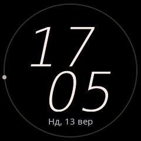
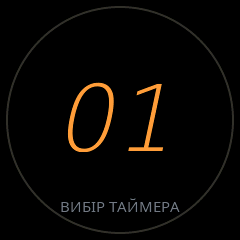
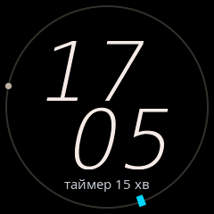
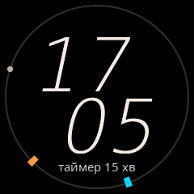
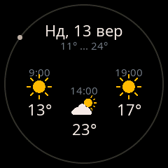
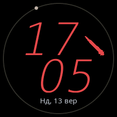
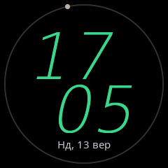
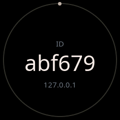

# Інструкція користувача та розробника HTRAM (Feature Manual)

Цей посібник документує поведінку, правила взаємодії, пріоритети апаратного арбітра (`htram_arbiter`) та скріншоти реального стану екрана пристрою **HTRAM** (Home Temperature & Radiation Monitor).

Усі наведені нижче скріншоти автоматично згенеровані безпосередньо з **попіксельного емулятора Linux Host (`htram-sim`)**, що компілюється з ідентичного коду прошивки (`core-ui.yaml`, `features/*.yaml`, `htram_gd32`, `LVGL 9`) без використання ручних симуляцій чи моків, які могли б розійтися з поведінкою фізичного пристрою.

---

## 1. Апаратний арбітр подій (Hardware Arbiter & Event Bus)

Взаємодія користувача з однією фізичною кнопкою керується централізованою контекстною шиною подій `htram_arbiter`. Кожна дія на кнопці транслюється в подію з урахуванням поточного контексту та пріоритету обробника.

### Контексти системи (`get_active_context()`)

| Пріоритет | Контекст | Умова активації | Поведінка кнопки |
|:---|:---|:---|:---|
| **1 (Найвищий)** | `silence_sacred` | 09:00:00 Хвилина мовчання | **Повне апаратне блокування.** Будь-які натискання поглинаються і ігноруються. |
| **2** | `silence_test` | Тестовий запуск Хвилини мовчання | Дозволено аварійне переривання тесту (одинарний або довгий клік). |
| **3** | `ringing` | Дзвінок будильника або сигнал завершення таймера | Керування вимкненням або відкладенням сигналу. |
| **4** | `modal_*` | Активний модальний екран (`modal_timer`, `modal_weather`, `modal_overlay`, `modal_ap`) | Керування активним модальним вікном (вибір значень, скидання, закриття). |
| **5 (Базовий)** | `clock` | Звичайний циферблат годинника | Перемикання слотів сенсорів, відкриття погоди, запуск таймера, діагностика IP. |

---

### Таблиця подій та пріоритетів (`Arbiter Event Table`)

| Контекст | Подія кнопки | Пріоритет | Обробник (`Handler`) | Дія системи |
|:---|:---|:---|:---|:---|
| `silence_sacred` | *будь-яка* | ∞ | `arbiter_lock` | Поглинається, сигнал у лог, жодної реакції на екрані. |
| `silence_test` | `button_single` | 100 | `silence_test_abort` | Негайне переривання тесту Хвилини мовчання, повернення на годинник. |
| `silence_test` | `button_long` | 100 | `silence_test_abort_long` | Негайне переривання тесту Хвилини мовчання, повернення на годинник. |
| `ringing` | `button_single` | 100 | `alarm_snooze_btn` | Якщо дзвенить будильник: відкласти дзвінок на 9 хв (`snooze`). |
| `ringing` | `button_double` | 100 | `alarm_dismiss_btn` | Якщо дзвенить будильник: вимкнути дзвінок (`dismiss`). |
| `ringing` | `button_long` | 100 | `alarm_dismiss_long_btn` | Якщо дзвенить будильник: вимкнути дзвінок (`dismiss`). |
| `ringing` | `button_single` | 90 | `timer_dismiss_single_btn`| Якщо дзвенить таймер: вимкнути сигнал завершення. |
| `ringing` | `button_double` | 90 | `timer_dismiss_double_btn`| Якщо дзвенить таймер: вимкнути сигнал завершення. |
| `ringing` | `button_long` | 90 | `timer_dismiss_long_btn`  | Якщо дзвенить таймер: вимкнути сигнал завершення. |
| `modal_weather` | `button_single` | 50 | `weather_close_btn` | Закрити екран погоди та повернутися до годинника. |
| `modal_timer` | `button_single` | 50 | `timer_modal_single_btn` | Циклічний вибір пресету (1 → 3 → 5 → 10 → 15 → 30 хв) або пауза/продовження. |
| `modal_timer` | `button_long` | 50 | `timer_modal_long_btn` | Скасувати таймер і повернутися до годинника. |
| `modal_overlay` | `button_single` | 100 | `core_dismiss_overlay` | Достроково закрити екран IP / Device ID. |
| `modal_ap` | `button_single` | 100 | `core_toggle_ap_page` | Перемкнути сторінку Captive Portal (QR-код ↔ реквізити WiFi). |
| `clock` | `button_long` | 50 | `timer_arm_btn` | Увійти в режим вибору таймера (`modal_timer`). |
| `clock` | `button_double` | 50 | `weather_open_btn` | Відкрити 3-денний прогноз погоди (`modal_weather`). |
| `clock` | `button_single` | 10 | `core_cycle_slot` | Перемкнути інформацію в нижньому слоті (Дата ↔ Температура/Вологість ↔ CO2/Таймер). |
| `clock` | `button_triple` | 10 | `core_show_net` | Показати поточну IP-адресу пристрою на 6 секунд. |

---

## 2. Галерея екранів та функції пристрою

### 2.1. Звичайний циферблат годинника (`01_clock`)



- **Великі похилі цифри**: шрифт `DejaVuSans-ExtraLight-Oblique` (92 px, 4 bpp, нахил 12°). Оновлюються похвилинно без повного перемальовування екрана.
- **Орбітальна секундна цятка**: обертається по зовнішньому безелю радіусом 114 px (крок 6° на секунду). Використовує апаратну синхронізацію 20 мс.
- **Нижній слот**: відображає поточну дату українською мовою (`Нд, 13 вер`) або чергується з показниками температури та вологості що 7 секунд.

---

### 2.2. Вибір та зведення таймера (`02_timer_arming`)



- **Активація**: Довге натискання кнопки на циферблаті годинника переводить систему в контекст `modal_timer`.
- **Керування**:
  - Одинарний клік перемикає фіксовані кухонні пресети: **1 хв → 3 хв → 5 хв → 10 хв → 15 хв → 30 хв** (зі звуковим сигналом підвищення тону).
  - Підпис внизу: `ВИБІР ТАЙМЕРА`.
  - **Автозапуск**: Якщо кнопку не чіпати протягом **2.5 секунд**, обраний таймер автоматично фіксується, звучить мелодія підтвердження, і система повертається на циферблат годинника.

---

### 2.3. Робота таймера та індикація на безелі (`03_timer_running_bezel`)



- **Фоновий відлік**: Годинник продовжує показувати точний поточний час.
- **Бірюзова засічка на безелі (`ui_timer_tick`)**: яскраво-бірюзова мітка (`#00D5FF`) на зовнішньому колі показує абсолютний час завершення таймера на 60-хвилинній шкалі.
- **Нижній слот**: автоматично фіксує рядок стану таймера (`таймер 15 хв`).
- **Фінальні 60 секунд**: екран автоматично переходить у модальний режим зворотного відліку великими бурштиновими секундами.
- **Керування**: Утримання кнопки (>1 с) скасовує таймер у будь-який момент.

---

### 2.4. Одночасна робота будильника та таймера (`04_dual_bezel_ticks`)



- **Засічка будильника (`ui_alarm_tick`)**: тепла помаранчева мітка (`#FF9E3D`) на 12-годинній шкалі (на скріншоті — встановлено на 07:30, позиція 225°).
- **Засічка таймера (`ui_timer_tick`)**: яскраво-бірюзова мітка (`#00D5FF`) на хвилинній шкалі.
- **Колізійна стійкість**: обидві мітки мають незалежні стилі та шари в LVGL 9, не затирають одна одну і чітко розрізняються за кольором і призначенням.

---

### 2.5. Триденний прогноз погоди (`05_weather_forecast`)



- **Активація**: Подвійний клік на годиннику (`button_double` у контексті `clock`).
- **Компонування**:
  - Вгорі: дата та діапазон добової температури (`11° ... 24°`).
  - Три частини доби: **Ранок (09:00)**, **День (14:00)**, **Вечір (19:00)**.
  - Піктограми погодних умов: вивантажуються як 1-бітні бінарні маски з SPI Flash пам'яті GD32 та динамічно колоруються в LVGL (золоте сонце, біла хмарка тощо) без перевитрати DRAM ESP32.
- **Закриття**: Одинарний клік або автоматичне закриття через 60 секунд.

---

### 2.6. Хвилина мовчання о 09:00:00 (`06_silence_tryzub`)


- **Активація**: Щодня автономно о 09:00:00 (або кнопка перевірки в Home Assistant).
- **Меморіальний візуальний режим**:
  - Цифри годинника та слоти приховуються.
  - У центрі екрана відмальовується Державний Герб — **Тризуб** у меморіальному червоному кольорі (`#C1121F`), зчитаний напряму зі збережених асетів SPI Flash.
  - Секундна цятка перетворюється на червону краплю пам'яті.
- **Акустичний супровід**:
  - 30 ударів метронома (392 Гц, соль малої октави) кожні дві секунди на атомних парних секундах.
  - Після завершення хвилини — мелодія Державного Гімну України.
- **Захист від переривання**: у священному режимі о 09:00 кнопка блокується на апаратному рівні.

---

### 2.7. Повітряна тривога та тип загрози (`07_alert_threat`)



- **Джерело**: Прямий локальний WebSocket з картою тривог JAAM (`jaam-one.local:81`).
- **Індикація на екрані**:
  - Цифри годинника забарвлюються в тривожний червоний колір (`#E5484D`) на перші 5 хвилин тривоги (зелений при відбої).
  - У верхньому правому статусному секторі з'являється піктограма конкретного типу загрози: **Балістика**, **Крилаті ракети**, **Шахеди/дрон**, **КАБи** або **Розвідник**.
- **Звуковий супровід**: Пріоритетний аудіосигнал тривоги (`SOUND_PRIO_ALERT = 40`), що перериває будь-які таймери чи сповіщення.

---

### 2.8. Діагностика: Перевірка IP-адреси (`08_network_ip`)



- **Активація**: Потрійний клік на годиннику (`button_triple` у контексті `clock`).
- **Призначення**: Швидко дізнатися локальну IP-адресу пристрою для підключення до веб-інтерфейсу OTA або REST API без необхідності заходити в адмінку роутера.
- **Тривалість**: Відображається протягом 6 секунд, після чого повертає звичайний циферблат.

---

### 2.9. Діагностика: Ідентифікатор пристрою (`09_device_id`)



- **Активація**: Кнопка «Показати ID пристрою» в Home Assistant.
- **Відображення**: Великі літери унікального ідентифікатора (частина MAC-адреси, наприклад `abf679`) та IP-адреса, що легко читаються з відстані кількох метрів.

---

## 3. Автоматизований запуск тестів (`tools/test_runner.py`)

Для перевірки всіх станів та оновлення скріншотів без підключення фізичного заліза використовується скрипт `tools/test_runner.py`.

### Запуск повного прогону тестів:
```bash
uv run python3 tools/test_runner.py
```

### Що робить скрипт:
1. Перевіряє наявність зібраного бінарника хост-симулятора (`htram-sim`). Якщо файл відсутній, автоматично збирає його через `uv run esphome compile esphome/htram-sim.yaml` (~4-5 секунд).
2. Запускає процес симулятора у фоні з фіксованим API портом `6053`.
3. Підключається через нативний протокол `aioesphomeapi`.
4. Послідовно інжектує події кнопки, погодні дані, тривоги, будильник та таймер.
5. Захоплює попіксельні PPM-дампи фреймбуфера 240×240 та конвертує їх у стиснені оптимізовані PNG у директорії `docs/screenshots/`.
6. Перевіряє успішність кожного стану через системні твердження (`assertions`) і генерує фінальний звіт.
