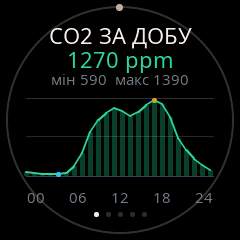
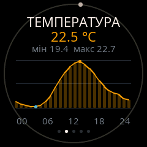
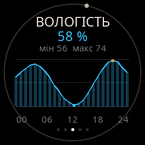
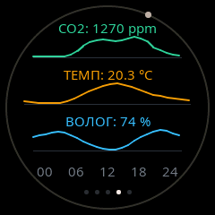
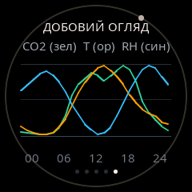

# Експериментальна функція: Добові графіки телеметрії (24h Telemetry Graphs)

Цей документ фіксує результати дослідження, розробки та симуляції модального екрана для перегляду 24-годинних графіків зміни показників мікроклімату (**CO2**, **Температура**, **Вологість**) на круглому дисплеї HTRAM (240×240 ST7789, активна зона $\approx 27\times 27\text{ мм}$, безель $\varnothing 228\text{ px}$).

---

## 1. Скріншоти з емулятора (Варіанти реалізації)

Усі наведені зображення згенеровані безпосередньо попіксельним симулятором Linux Host (`htram-sim`) на основі LVGL 9.

### Варіант 1: Почерговий детальний перегляд метрик

Кожна метрика відображається на окремому повноекранному графіку з високою деталізацією, числовим діапазоном min/max, маркерами екстремумів та напівпрозорою вертикальною заливкою (`area fill`). Перемикання між метриками здійснюється **подвійним кліком**.

| CO2 (0..24h) | Температура (0..24h) | Вологість (0..24h) |
|:---:|:---:|:---:|
|  |  |  |
| Смарагдовий графік CO2, пік 1390 ppm о 16:00 | Бурштиновий графік, діапазон 19.4°...22.7°C | Блакитний графік, діапазон 56%...74% |

---

### Варіант 2: Триптих (Три компактні sparklines на одному екрані)

Одночасне відображення всіх трьох показників у вигляді компактних кривих висотою 28 px із поточними значеннями.

  

* **Переваги**: Одночасний огляд динаміки приміщення одним поглядом.
* **Недоліки**: Низька амплітуда коливань на малому екрані, відсутність окремих міток min/max.

---

### Варіант 3: Суміщений огляд (Три нормалізовані криві на одній сітці)

Усі 3 показники нормалізовано до шкали 0..100% та накладено на єдину чартову зону.

  

* **Переваги**: Наочна демонстрація взаємної кореляції (наприклад, провітрювання призводить до падіння CO2 і температури).
* **Недоліки**: Перетин трьох кривих створює надлишковий візуальний шум на 27 мм дисплеї.

---

## 2. Аналіз практичності на фізичному пристрої

Після візуальної оцінки в емуляторі зроблено висновок, що **добові графіки мають обмежену практичну цінність на фізичному екрані HTRAM**:
1. **Фізичний розмір**: Екран має розмір лише $27\times 27\text{ мм}$ (діаметр активної лінзи $\approx 65\text{ мм}$). На такій площі з типової відстані робочого столу (50–70 см) графічні криві зчитуються значно важче, ніж великі контрастні цифри основного годинника чи статусних слотів.
2. **Невідповідність концепції пристрою**: HTRAM спроєктовано як фоновий настільний монітор («поглянув за 0.5 секунди — зрозумів стан»). Аналіз складних добових графіків набагато зручніше та детальніше робити на смартфоні чи комп'ютері через інтерфейс Home Assistant.
3. **Керування однією кнопкою**: Використання 4 кліків для входу та подвійних кліків для каруселі перевантажує ергономіку єдиної фізичної кнопки.

---

## 3. Архітектура та збережені файли

Код реалізовано з повною відповідністю до вимог проекту:
* [`esphome/features/graphs.yaml`](file:///workspaces/htram-esphome/esphome/features/graphs.yaml) — ізольований пакет фічі (UI на LVGL 9 `lv_line`, арбітр, скрипти, тайм-аут 60 с).
* Векторні статичні точки точок (`lv_point_precise_t[24]`) — використання DRAM менше 1 КБ, повна відсутність динамічних алокацій пам'яті.
* Апаратний арбітр: вхід за 4 кліками (`button_quadruple`), вихід за одинарним кліком (`button_single`), циклічність за подвійним кліком (`button_double`).
* Підтримка попіксельного тестування у [`tools/test_runner.py`](file:///workspaces/htram-esphome/tools/test_runner.py).
