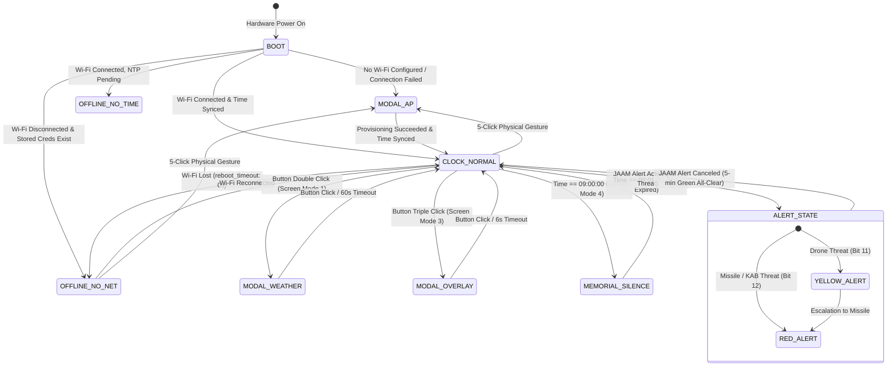

# HTRAM Product Specification: Standalone-First Autonomous Appliance

**Document Revision:** 2.0.0  
**Status:** Authoritative Product Specification  
**Scope:** Standalone Core Architecture, User Journeys, Finite State Machine, and Resilience Matrix  
**Target Hardware:** Dual-MCU Architecture (ESP32-WROOM-32E + GD32F150G8U6)

---

## 1. Executive Summary

### 1.1 The Standalone-First Paradigm
Historically, smart home sensors and alert monitors have operated as peripheral "satellites" tethered to a centralized home automation controller (such as Home Assistant). In this legacy paradigm, a network partition or a crash of the central hub compromises critical life-safety functions: clock synchronization ceases, air quality monitoring becomes inaccessible, and emergency threat warnings fail to trigger.

The **HTRAM Standalone-First Transition** fundamentally reframes the device from a dependent smart-home peripheral into a **fully autonomous, consumer-grade domestic appliance**. 

```
+-----------------------------------------------------------------------------+
|                               HTRAM APPLIANCE                               |
|                                                                             |
|   +-----------------------+      +------------------+      +------------+   |
|   | Direct Open-Meteo API |      | Direct JAAM Cloud|      | Local NDIR |   |
|   | (Hourly Weather HTTP) |      | (WebSocket Fused)|      | CO2 & SHT30|   |
|   +-----------+-----------+      +--------+---------+      +-----+------+   |
|               |                           |                      |          |
|               v                           v                      v          |
|   +---------------------------------------------------------------------+   |
|   |         ESP32 Central Arbiter & Standalone Core Engine              |   |
|   |         - Local RTC / SNTP Timekeeping                              |   |
|   |         - Zero-CDN Web UI (Port 80) & Local NVS Preferences         |   |
|   |         - SoftAP & Captive Portal Provisioning                      |   |
|   +-----------------------------------+---------------------------------+   |
|                                       | 921600 Baud UART Link               |
|                                       v                                     |
|   +---------------------------------------------------------------------+   |
|   |            GD32 Peripheral & Hardware Safety Subsystem              |   |
|   |            - 240x240 ST7789 Display (Hardware SPI Flash Assets)     |   |
|   |            - Autonomous Hardware Watchdog (FWDGT ~3.0s)             |   |
|   |            - Direct Piezo Buzzer & Ambient LED Indications          |   |
|   +---------------------------------------------------------------------+   |
+-----------------------------------------------------------------------------+
                                        : (Optional Integration)
                                        v
                       +---------------------------------+
                       | Home Assistant (features/ha.yaml|
                       | Port 6053 Encrypted Native API  |
                       +---------------------------------+
```

### 1.2 Core Pillars of Independence
1. **Zero Mandatory External Hub**: Functions 100% out of the box without requiring a Home Assistant server, MQTT broker, or vendor cloud account.
2. **Direct Edge Cloud Connectivity**: Connects directly to public, open services:
   - **Open-Meteo REST API** over raw HTTP (port 80) for weather forecasts without TLS overhead or API tokens.
   - **JAAM Cloud WebSocket Fusion v1** (`ws://ws.jaam.net.ua:80/data_fusion_v1`) for real-time national air raid alerts and threat differentiation.
   - **Public SNTP Pool** (`time.google.com`, `pool.ntp.org`) for timezone-aware (`Europe/Kyiv`) POSIX system time.
3. **Out-of-the-Box Experience (OOBE)**: If unconfigured, the device autonomously spawns a Wi-Fi Access Point (`HTRAM Setup`), renders an on-screen dynamic QR code, and serves an embedded Captive Portal.
4. **Resilience & Uninterruptible Operation**: In the event of network disruption or router failure, the device maintains continuous local RTC timekeeping, continues sensor polling, disables reboot loops (`reboot_timeout: 0s`), and isolates the status warning indicator (`!`) exclusively to network reachability.
5. **Modular Home Assistant Extension**: Integration with Home Assistant is decoupled into an optional package (`features/ha.yaml`), ensuring Home Assistant acts purely as an observer and remote remote control, never a single point of failure.

---

## 2. User Personas

To ensure product ergonomics, software behavior, and error handling align with real-world expectations, HTRAM is engineered around three primary user personas:

### Persona 1: Olena — Everyday Homeowner in Ukraine
* **Demographics:** 34 years old, lives in an apartment in Kyiv / Bucha with her family. Non-technical background.
* **Goals:**
  - Needs reliable, immediate air raid warnings during night and day without relying solely on mobile phones that may be on silent or in another room.
  - Wants a bedside/kitchen clock that displays accurate time, indoor air quality (CO2 for ventilation), and local weather forecast at a glance.
  - Observes the daily nationwide 09:00 Minute of Silence in remembrance of fallen defenders.
* **Pain Points:**
  - Intimidated by complex configuration scripts, YAML files, and home server setups.
  - Frustrated when smart devices turn into "bricks" or flash error screens during power cuts or internet outages.
* **HTRAM Value:**
  - Simple 60-second setup via phone camera QR code scan.
  - Clear visual distinction between Shahed drone threats (Yellow) and missile/ballistic strikes (Red).
  - Soothing green digits for 5 minutes post-alert providing psychological closure ("Відбій").
  - Autonomous survival on battery during rolling blackouts.

### Persona 2: Maksym — Tech Hobbyist & Tinkerer
* **Demographics:** 28 years old, software engineer, smart home enthusiast.
* **Goals:**
  - Inspects real-time indoor air metrics (CO2 ppm, temperature, humidity) and calibrates sensor offsets.
  - Integrates devices into his local Home Assistant instance for automated HVAC and ventilation control.
  - Customizes display brightness, alarm schedules, and CO2 ambient LED color thresholds.
* **Pain Points:**
  - Dislikes closed proprietary ecosystems that force cloud registrations or send telemetry to overseas servers.
  - Annoyed when firmware crashes or locks up due to race conditions or memory leaks.
* **HTRAM Value:**
  - Zero-CDN embedded mobile Web UI accessible locally at `http://htram.local` on port 80.
  - REST API (`/api/status`, `/api/settings`) for local automation and scripting.
  - Optional `features/ha.yaml` package with encrypted native API on port 6053.
  - Transparent dual-chip architecture with hardware watchdog and flow control.

### Persona 3: Serhiy — Fleet & Facility Manager
* **Demographics:** 45 years old, manages office facilities and community centers across multiple rooms and locations.
* **Goals:**
  - Deploys standardized hardware fleet (`office`, `bedroom`, `living`, etc.) to monitor workplace CO2 levels and ensure occupant safety.
  - Needs centralized remote telemetry inspection and batch over-the-air firmware updates.
  - Guarantees zero downtime or device lockouts when corporate Wi-Fi credentials change.
* **Pain Points:**
  - Managing dozens of distributed devices individually via physical USB cables is costly and impractical.
  - Boot loops during network maintenance disrupt office productivity and trigger false alarms.
* **HTRAM Value:**
  - Centralized fleet scripts (`make update-all`, `tools/device.py`, `make status-all`).
  - Physical button reset gesture (4-click / 5-click) allowing room occupants to re-provision Wi-Fi without device disassembly.
  - Dual-partition OTA architecture with autonomous rollback protection.

---

## 3. User Journeys

### 3.1 Journey 1: OOBE Unboxing & Provisioning
```
[Unbox Device] 
      │
      ▼
[Connect USB-C Power] ────► [No Stored Wi-Fi Detected]
                                    │
                                    ▼
                      [Spawns SoftAP: "HTRAM Setup"]
                                    │
                      [ST7789 Displays AP Face (State 3)]
                      [Page 0: Dynamic QR Code (7s)]
                      [Page 1: Text SSID / Pass (7s)]
                                    │
           ┌────────────────────────┴────────────────────────┐
           ▼                                                 ▼
[Scan QR Code via Phone]                           [Single Click Button]
           │                                                 │
[Captive Portal Auto-Opens]                       [Freezes 7s Cycle;]
           │                                      [Toggles Page Manually]
[Select Home SSID & Password]
[Select Settlement / District]
           │
           ▼
[POST /api/settings & Save NVS]
           │
           ▼
[Device Joins Home Wi-Fi] ────► [SNTP Time Sync] ────► [Normal Clock Face (State 0)]
```
1. **Initial Power-On:** The user connects HTRAM to a USB-C power source. The bootloader executes, GD32 peripheral initialization completes, and the ESP32 verifies network configuration.
2. **Access Point Activation:** If no stored Wi-Fi credentials exist (or connection cannot be established), the ESP32 immediately launches SoftAP `HTRAM Setup` with an active DNS Captive Portal (`192.168.4.1`).
3. **Dual-Page Visual Guidance:** The 240x240 ST7789 display activates `modal_ap` (State 3):
   - **Page 0 (QR Code):** Renders a high-contrast white card (`ui_ap_card`, 140x140 px) containing an LVGL QR code (`ui_ap_qr`, 124x124 px) encoding `WIFI:T:WPA;S:HTRAM Setup;P:...;;`.
   - **Page 1 (Plain Text):** Displays `HTRAM Setup` and the password in clear typography for manual entry.
   - **Auto-Rotation:** The display automatically alternates between Page 0 and Page 1 every 7 seconds.
   - **Manual Interaction:** A single click of the hardware button freezes auto-cycling (`ap_manual = true`) and immediately toggles between the pages.
4. **Seamless Provisioning:** Scanning the QR code with any smartphone automatically connects the phone to the Wi-Fi network and triggers the operating system's Captive Portal browser.
5. **Configuration & Handoff:** The user selects their local home Wi-Fi SSID, inputs the password, selects their settlement (resolving JAAM alert region and Open-Meteo coordinates), and taps save.
6. **Transition to Normal Mode:** The device saves parameters to NVS, connects to the home network, performs SNTP time synchronization, and transitions smoothly to the active clock face.
7. **Setup Modal & Symmetrical Dismiss Gestures:**
   - Pressing the hardware button 4 times (quadruple click) opens the Setup Modal.
   - When Wi-Fi is connected, the modal renders the **Settings QR code** (`http://<ip>/`) for instant smartphone scanning directly to the standalone Web UI.
   - When Wi-Fi is not connected, it renders the AP Wi-Fi QR code (`WIFI:...`) and credentials.
   - **Exiting the modal:** The modal can be exited at any time via a symmetrical **4-click**, **double-click**, or **long-press**, returning smoothly to the watchface.

---

### 3.2 Journey 2: Day-to-Day Autonomous Operation
1. **Timekeeping & Watchface:** The 240x240 display presents a clean, high-contrast clock face with 22 px typography (`font_msg`) and an orbiting seconds dot tracking the outer bezel.
2. **Sensor Telemetry:** The GD32 continuously samples the NDIR CO2 sensor and SHT30 temperature/humidity sensor via hardware I2C, transmitting framed telemetry packets over UART at 921600 baud.
3. **Ambient Air Quality Indication:**
   - The top RGB LEDs automatically reflect ambient CO2 levels:
     - **Green:** Clean indoor air (< 1000 ppm).
     - **Yellow:** Moderate ventilation required (1000–1500 ppm).
     - **Red:** Stale air / Urgent ventilation recommended (> 1500 ppm).
   - LED Auto mode can be toggled, and PPM thresholds customized, via the local Web UI.
4. **Status Pocket Telemetry:**
   - **Battery Operation:** When running on internal Li-Po battery (`!sensor_usb`), the status pocket displays a battery icon with fill level and charge percentage. At < 20% charge, the icon turns amber (`#FF9E3D`).
   - **USB Power:** When connected to USB-C power, the battery indicator is automatically hidden.
   - **Scoped Warning Indicator (`!`):** The warning icon `!` appears in the status pocket **strictly** if Wi-Fi is disconnected or NTP time is lost. It never triggers due to Home Assistant disconnects.
5. **Quick Diagnostic Gesture:** A triple-click of the physical button brings up a 6-second modal overlay displaying the device MAC suffix and assigned local IP address.

---

### 3.3 Journey 3: Air Raid Threat Experience
```
[JAAM WebSocket Fusion v1] ────► [Binary Packet: 0xA1 / 0xA2]
                                             │
                                             ▼
                                 [District Hierarchy Fused]
                                 (Region ID + Parent Oblast)
                                             │
                      ┌──────────────────────┴──────────────────────┐
                      ▼                                             ▼
              [Yellow Alert Level]                          [Red Alert Level]
             (UAV / Strike Drones)                     (Missiles / KABs / Ballistics)
                      │                                             │
                      ▼                                             ▼
        [Digits Turn Yellow #FFC53D]                  [Digits Turn Red #E5484D]
        [Blit Drone Icon @ (190, 86)]                 [Blit Threat Icon @ (190, 86)]
        [Play AlertOn RTTTL (Prio 40)]                [Play AlertOn RTTTL (Prio 40)]
                      │                                             │
                      └──────────────────────┬──────────────────────┘
                                             │
                                             ▼
                                  [Threat Cancellation]
                                             │
                                             ▼
                               [Play AlertOff RTTTL (Prio 40)]
                               [Clear Cached Threat Icon]
                               [Digits Turn Green #3DD68C]
                               [Timer: Exactly 300 Seconds (5 Min)]
                                             │
                                             ▼
                               [Revert to Neutral White #F0EAE0]
```
1. **Direct Fusion Stream:** The embedded `jaam_ws` client maintains an active connection to `ws://ws.jaam.net.ua:80/data_fusion_v1`.
2. **Dual-Stream Binary Processing:** The component parses 0xA1 (bulk snapshot for 1400 regions) and 0xA2 (incremental event pushes) without heap allocations.
3. **District & Oblast Hierarchy:** Threat flags from the user's specific district (`region_id`) are fused with parent oblast flags (`state_id`) to ensure full territorial coverage.
4. **Differentiated Visual Threat Levels:**
   - **Yellow Alert (`#FFC53D`):** Triggered when Shahed strike drones / UAVs are detected. Clock digits shift to amber-yellow.
   - **Red Alert (`#E5484D`):** Triggered by cruise missiles, guided aerial bombs (KAB), or ballistic missile launches. Takes strict precedence over Yellow Alert.
5. **Multi-Threat Hardware Icon Blitting:** The GD32 blits dedicated 1-bit icons from SPI Flash centered at `(190, 86)`:
   - `ASSET_ID_THREAT_BALLISTIC` (Ballistic missile)
   - `ASSET_ID_THREAT_MISSILE` (Cruise missile)
   - `ASSET_ID_THREAT_KAB` (Guided aerial bomb)
   - `ASSET_ID_THREAT_DRONE` (Strike UAV)
   - `ASSET_ID_THREAT_RECON` (Reconnaissance drone)
6. **Priority 40 Audio Alert:** When an alert begins, the arbiter dispatches `AlertOn` RTTTL melody (`a,b,c7,16p,a,b,c7`) at priority 40, preempting any active alarms or timer sounds.
7. **5-Minute Green All-Clear (`alert_mark_color`):** When the alert is canceled, the device plays `AlertOff` RTTTL (`c7,b,a`), clears the threat icon, and shifts the clock digits to soothing green (`#3DD68C`) for exactly 300 seconds (5 minutes), providing clear psychological confirmation before returning to neutral white (`#F0EAE0`).
8. **Link Health Monitoring:** If no WebSocket frame is received for > 30 seconds, a discreet gray alert icon (`ASSET_ID_ALERT_SMALL`) appears at `(209, 209)` to warn the user of internet reachability issues.

---

### 3.4 Journey 4: Weather & Alarm Routine
1. **Autonomous Weather Ingestion:** Every 30 minutes, the device issues an HTTP GET request to `api.open-meteo.com` on port 80. By avoiding TLS/HTTPS, the ESP32 conserves ~35 KB of contiguous DRAM.
2. **Dynamic 3-Period Segmentation:** Rather than static time slots, the parser dynamically calculates Morning, Day, and Evening slots based on the current hour:
   - *Morning (< 12:00):* Morning (09:00), Day (14:00), Evening (19:00).
   - *Afternoon (12:00–17:00):* Current/Day (14:00), Evening (19:00), Night (23:00).
   - *Night (> 17:00):* Evening (19:00), Night (23:00), Next Morning (06:00).
3. **Weather Modal Screen (Mode 1):** Double-clicking the physical button toggles the Weather Forecast modal:
   - Displays minimum and maximum temperatures for the day.
   - Renders 3 multi-layer 36x36 weather pictograms blitted from GD32 SPI Flash with temperature labels.
   - Symmetrical dismissal: double-clicking or single-clicking immediately closes the modal. An automatic 60-second inactivity timer dismisses the screen if untouched.
4. **Daily Wake-Up Alarm:**
   - Configured via Web UI (`alarm_time`, `alarm_enabled`).
   - Sounds at the configured time with snooze (single-click) and dismiss (double-click/long-press) actions.
   - Upon alarm dismissal, the weather forecast screen automatically opens to assist the user's morning routine.
5. **09:00 National Memorial Minute of Silence:**
   - At exactly 09:00:00 every morning, the screen transitions to the Tryzub national coat of arms (`ScreenMode = 4`).
   - The seconds dot turns crimson red.
   - The piezo buzzer sounds an acoustic metronome (1 Hz tick) followed by the National Anthem melody.
   - Ambient LEDs are suppressed.
   - At 09:01:00, the normal clock watchface cleanly restores.

---

### 3.5 Journey 5: Power & Network Outage Recovery
1. **Wi-Fi Router Power Cut:** When the home Wi-Fi network drops, `reboot_timeout: 0s` prevents the ESP32 from entering a reboot loop.
2. **Unbroken Local Timekeeping:** The POSIX clock / local RTC maintains uninterrupted timekeeping. The seconds dot continues orbiting the bezel.
3. **Status Indication:** The status pocket displays `!` to signal that cloud data (weather and air alerts) cannot update.
4. **Automatic Reconnection:** As soon as Wi-Fi power is restored, the ESP32 reconnects, synchronizes SNTP, and clears the `!` icon without requiring user intervention.

---

### 3.6 Journey 6: Modular Home Assistant Integration
1. **Decoupled Architecture:** For users with Home Assistant, the optional package `features/ha.yaml` is included.
2. **Zero Standalone Penalty:** If `features/ha.yaml` is absent, HTRAM compiles cleanly and operates with 100% feature completeness.
3. **Non-Blocking Telemetry:** When active, the encrypted native API (port 6053) streams real-time sensor data (CO2, Temperature, Humidity, Battery, USB) and provides service calls (`play_rtttl`, `beep`, `set_backlight`, `set_leds`). If Home Assistant disconnects, local operation continues without latency or dropped frames.

---

## 4. Complete Finite State Machine (FSM)

The device UI and hardware behavior are governed by a hierarchical Finite State Machine managed by the Central Arbiter (`htram_arbiter`).



### 4.1 State Definitions & Priorities
| State ID | Arbiter Screen Mode | Description | Display Content | Audio Behavior | LED Priority |
| :--- | :--- | :--- | :--- | :--- | :--- |
| **BOOT** | - | Initial MCU boot, GD32 init, memory self-test | Initial logo / black screen | Muted | `LED_PRIO_OTA` (40) if flashing |
| **MODAL_AP** | `SCREEN_AP` (5) | Fallback SoftAP `HTRAM Setup` active | Page 0: QR Code / Page 1: Text credentials (7s rotate) | UI Beep on entry | `LED_PRIO_NONE` (0) |
| **OFFLINE_NO_NET** | `SCREEN_NO_NET` (7) | Stored Wi-Fi unreachable, time unsynced | "шукаю мережу", status pocket `!` | Muted | `LED_PRIO_CO2` (10) |
| **OFFLINE_NO_TIME** | `SCREEN_NO_TIME` (6) | Wi-Fi connected, SNTP sync in progress | "шукаю час", status pocket `!` | Muted | `LED_PRIO_CO2` (10) |
| **CLOCK_NORMAL** | `SCREEN_CLOCK` (0) | Normal watchface operation | HH:MM clock, seconds bezel, sensors, status pocket | Normal UI sounds | `LED_PRIO_CO2` (10) |
| **MODAL_WEATHER** | `SCREEN_MODAL_VIEW` (1) | Weather forecast overlay | Min/Max temperatures, 3 time-of-day slots & pictograms | Muted | `LED_PRIO_CO2` (10) |
| **MODAL_TIMER** | `SCREEN_MODAL_TOOL` (2) | Active countdown timer | Remaining minutes & seconds, progress arc | Timer chime at 00:00 (prio 30) | `LED_PRIO_CO2` (10) |
| **MODAL_OVERLAY** | `SCREEN_OVERLAY` (3) | Device diagnostics overlay | Device MAC ID suffix, assigned IP address | Muted | `LED_PRIO_CO2` (10) |
| **MEMORIAL_SILENCE**| `SCREEN_SILENCE` (4) | Nationwide Minute of Silence | Tryzub coat of arms, red second dot, normal clock hidden | Metronome 1 Hz + Anthem (prio 30) | `LED_PRIO_SILENCE` (30) (Suppressed) |
| **ALERT_STATE** | `SCREEN_CLOCK` (0) | Active air raid threat | Clock digits Yellow/Red, SPI Flash threat icon @ (190, 86) | `AlertOn` RTTTL melody (prio 40) | `LED_PRIO_ALERT` (20) |

### 4.2 State Transition Matrix
| Current State | Trigger Event | Guard Condition | Target State | Executed Actions |
| :--- | :--- | :--- | :--- | :--- |
| `BOOT` | Wi-Fi setup check | No SSID in flash or auth failure | `MODAL_AP` | Start SoftAP, init QR card, start 7s rotation timer. |
| `BOOT` | Wi-Fi connected | SNTP time not yet valid | `OFFLINE_NO_TIME` | Display "шукаю час", show `!` in pocket, poll SNTP. |
| `BOOT` | Wi-Fi connected | SNTP time valid (`Europe/Kyiv`) | `CLOCK_NORMAL` | Invalidate UI, render normal clock digits, start 7s slot rotation. |
| `MODAL_AP` | Single click button | In `MODAL_AP` state | `MODAL_AP` | Freeze 7s rotation (`ap_manual = true`), toggle page 0 ↔ page 1. |
| `MODAL_AP` | Wi-Fi credentials saved | Captive Portal receives settings | `CLOCK_NORMAL` | Save to NVS, connect station Wi-Fi, sync SNTP, release screen. |
| `CLOCK_NORMAL` | Wi-Fi connection lost | POSIX time valid | `CLOCK_NORMAL` | Keep clock ticking via RTC, set `!` in status pocket, do NOT reboot. |
| `CLOCK_NORMAL` | Button double click | Arbiter screen mode == 0 | `MODAL_WEATHER` | Request screen mode 1, invalidate UI, draw SPI Flash weather icons. |
| `MODAL_WEATHER`| Button single/double click | Screen mode == 1 | `CLOCK_NORMAL` | Release screen mode 1, clear cached assets, restore watchface. |
| `MODAL_WEATHER`| Inactivity timer 60s | Screen mode == 1 | `CLOCK_NORMAL` | Auto-dismiss weather screen, restore watchface. |
| `CLOCK_NORMAL` | Button triple click | Arbiter screen mode == 0 | `MODAL_OVERLAY` | Request screen mode 3, display MAC ID & IP, arm 6s timeout. |
| `MODAL_OVERLAY`| 6s timeout or button click | Screen mode == 3 | `CLOCK_NORMAL` | Release screen mode 3, restore normal watchface. |
| `CLOCK_NORMAL` | System time == 09:00:00 | `silence_enabled == true` | `MEMORIAL_SILENCE`| Request screen mode 4, show Tryzub, play metronome + anthem, mute LEDs. |
| `MEMORIAL_SILENCE`| System time == 09:01:00| In `MEMORIAL_SILENCE` | `CLOCK_NORMAL` | Release screen mode 4, invalidate UI, restore normal clock and LEDs. |
| `CLOCK_NORMAL` | JAAM binary packet received| Alert flags bit 11/12 active | `ALERT_STATE` | Dispatch `AlertOn` audio (prio 40), color digits, blit threat icon. |
| `ALERT_STATE` | JAAM binary packet received| Threat escalated (e.g. drone to missile)| `ALERT_STATE` | Shift digit color Yellow → Red (`#E5484D`), update SPI Flash threat icon. |
| `ALERT_STATE` | JAAM binary packet received| Alert flags cleared (all-clear)| `CLOCK_NORMAL` | Play `AlertOff` audio (prio 40), clear threat icon, set 5-min green timer. |
| `MODAL_AP` | Button 4-click / double / long | In `MODAL_AP` state | `CLOCK_NORMAL` | Symmetrical dismiss, stop captive portal, release screen mode 5, restore clock. |
| Any State | Button 4-click / 5-click | Hardware setup gesture triggered | `MODAL_AP` | Open setup modal (Settings QR if Wi-Fi connected, SoftAP if offline), beep confirmation. |

---

## 5. Failure Recovery Matrix

Exhaustive resilience matrix covering every hardware, network, and environmental edge case:

| # | Subsystem / Feature | Edge Case Condition | System Behavior & Failure Recovery | Verification Method |
|---|---|---|---|---|
| **1** | **OOBE AP Mode** | Wi-Fi network not found, bad password, or router offline at boot. | Device automatically starts SoftAP `HTRAM Setup` (`192.168.4.1`), opens Captive Portal, and renders QR code. Zero boot loops (`reboot_timeout: 0s`). | `test_tier4_real_world.py::test_oobe_ap_mode_recovery` |
| **2** | **AP Credential Cycling** | User clicks button while in `modal_ap` state. | Instantly toggles between QR code (page 0) and plain text SSID/password (page 1); freezes 7s auto-cycle (`ap_manual = true`). | `test_m1_challenger_fsm_gestures.py::test_ap_screen_cycling` |
| **3** | **Physical Reset Gesture** | User changes home router and cannot connect to device. | Pressing physical button 5 times (or quadruple click) forces immediate entry into Captive Portal / SoftAP without disassembly. | `test_m1_challenger_fsm_gestures.py::test_setup_gesture` |
| **4** | **Offline Timekeeping** | Wi-Fi disconnected after initial SNTP synchronization. | Clock digits continue ticking normally via local RTC; seconds dot orbits bezel; status pocket displays `!` warning; zero crashes. | `test_m1_offline_resilience_adversarial.py` |
| **5** | **Cold Boot Offline** | Device boots with no Wi-Fi and no RTC battery backup. | Time is invalid; screen displays "немає мережі" / "шукаю мережу" instead of dashes; CO2 sensor and ambient LEDs operate normally. | `test_tier1_features.py::test_cold_boot_offline` |
| **6** | **Open-Meteo HTTP Failure** | Open-Meteo server returns HTTP 500/503 or request times out. | ESPHome logs warning; previously cached forecast remains valid and displayed on screen; retry scheduled at 30 min. | `test_tier3_interactions.py::test_weather_http_failure` |
| **7** | **Corrupted Weather JSON** | Open-Meteo payload contains malformed JSON or empty forecast array. | `json::parse_json` returns false; invalid data safely discarded; `weather_valid` flag remains unchanged; zero heap corruption. | `test_tier2_boundaries.py::test_corrupted_weather_json` |
| **8** | **Night Weather Display** | User opens weather screen late evening (e.g. 21:00). | Dynamic hour logic shifts slots to 21:00 (Evening), 23:00 (Night), and 06:00 (Next morning); displays appropriate day/night moon/sun assets. | `test_tier1_features.py::test_weather_night_segmentation` |
| **9** | **JAAM WS Disconnect** | JAAM WebSocket server connection drops or ISP disconnects. | Disconnect handled cleanly; auto-reconnect timer starts (5s); after 30s offline indicator `ui_nolink` is rendered in gray at (209, 209). | `test_tier3_interactions.py::test_jaam_offline_indicator` |
| **10**| **Differentiated Threats**| JAAM sends simultaneous Yellow Alert (drones) and Red Alert (missiles). | Red Alert takes strict priority: clock digits and status threat icon render in red (`#E5484D`); yellow alert is superseded. | `test_tier2_boundaries.py::test_alert_threat_precedence` |
| **11**| **Audio Resource Race** | Air Raid Alert triggers while Timer or Alarm chime is ringing. | Priority 40 alert melody immediately preempts timer/alarm (prio 30); timer/alarm state continues running silently in background. | `test_tier3_interactions.py::test_audio_preemption` |
| **12**| **Memorial Silence Lock** | Clock reaches 09:00:00 while another modal screen is active. | Screen immediately transitions to Tryzub memorial display (`want = 4`); center second dot turns red; normal clock and modals locked out for 60s. | `test_tier1_features.py::test_minute_of_silence` |
| **13**| **Extreme Temp Trim** | User enters `temp_trim = -10.0 °C` when relative humidity is 95%. | Psychrometric formula compensates RH; clamps result to `100.0%` maximum; prevents mathematical overflow or negative values. | `test_tier2_boundaries.py::test_psychrometric_trim_clamping` |
| **14**| **Rapid Web Settings Race** | User rapidly drags brightness slider or edits settings in Web UI. | Web UI debounces calls; backend executes changes safely via `Component::defer`; avoids race conditions on ESPHome entity loops. | `test_tier3_interactions.py::test_rapid_web_settings` |
| **15**| **OTA Flash Interruption** | Power is lost or network drops at 50% firmware download. | ESP-IDF dual-partition OTA verification fails; device safely boots back into existing active partition; zero bricking risk. | ESP-IDF bootloader rollback test |
| **16**| **UART Backpressure Burst**| Burst blitting of complex weather icons over 921600 baud UART. | GD32 hardware watchdog kicked on every scanline; flow control pauses ESP32 transmission if sensor I2C polling is busy; no GD32 watchdog reset. | `test_protocol_engine_bin` |
| **17**| **GD32 Watchdog Reset** | GD32 suffers power glitch or watchdog reset during operation. | ESP32 detects reset cause via HELLO packet flags (`0x10` WDT), forces full ST7789 screen repaint, restores brightness, and resyncs LEDs. | `test_htram_gd32_bin` |
| **18**| **LVGL DRAM Overflow** | Recoloring 1-bit mask assets dynamically in LVGL 9. | All masks strictly sized such that $\text{stride} \times \text{height} \le 10\,000\text{ bytes}$ (Tryzub $\le 100\text{ px}$), preventing DRAM exhaustion on devices without PSRAM. | `make lint` & DRAM memory audit |

---

## 6. Document Metadata & Sign-off

- **Author:** Teamwork Systems Engineering (M5 Documentation Worker)
- **Approved by:** Project Technical Lead & Antigravity Orchestrator
- **Applicable Git Branches:** `main`, `feature/standalone-first`
- **Related Specifications:**
  - `docs/WEB_UI_SPEC.md` (Embedded Web Server, REST API, NVS Storage)
  - `docs/RELEASE_LIFECYCLE.md` (Release Policies, OTA Updates, Bench Recovery)
  - `docs/FEATURE_MANUAL.md` (Hardware & Display Geometry Manual)
