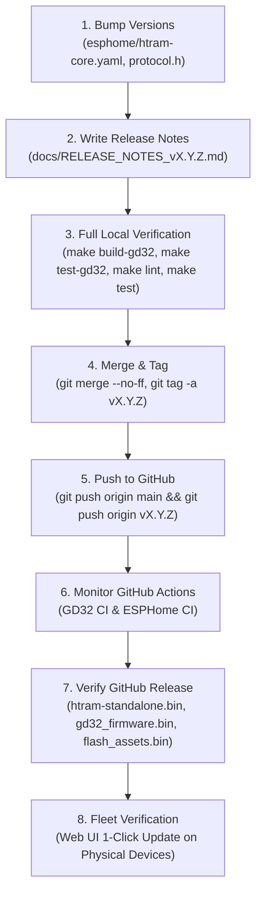

# HTRAM Release Lifecycle, CI/CD & Recovery Specification

**Document Revision:** 2.0.0  
**Status:** Authoritative Lifecycle Specification  
**Scope:** SemVer Release Policies, Dual-Track GitHub CI, 1-Click OTA Architecture, and Hardware Bench Recovery  
**Target MCUs:** ESP32-WROOM-32E & GD32F150G8U6

---

## 1. Release Policy & Semantic Versioning

### 1.1 Semantic Versioning Standard
HTRAM strictly follows the **Semantic Versioning 2.0.0** convention:
$$\text{v}\mathbf{MAJOR}.\mathbf{MINOR}.\mathbf{PATCH}$$

```
   v 2 . 0 . 0
     │   │   │
     │   │   └── PATCH: Backward-compatible bug fixes, calibration tweaks, RAM optimizations
     │   └────── MINOR: New features, new screens/modals, non-breaking protocol additions
     └────────── MAJOR: Architectural transitions, breaking binary protocol changes, partition changes
```

#### Versioning Criteria
- **MAJOR (vX.0.0):**
  - Architectural overhauls (e.g. Transition to Standalone-First autonomous appliance).
  - Breaking binary protocol changes across the 921600 baud ESP32-GD32 UART link.
  - Flash partition table reallocations (e.g. changing OTA partition boundary from 0x1C0000).
  - Removal of deprecated configuration entities or public REST API endpoints.
- **MINOR (v1.X.0):**
  - Introduction of new features (e.g. Open-Meteo Weather forecast screen, Countdown Timer, Web UI controls).
  - Non-breaking extensions to the UART protocol or REST API (e.g. adding new packet types while preserving backward compatibility).
  - Addition of new peripheral drivers or display widgets.
- **PATCH (v1.0.X):**
  - Targeted bug fixes and edge case resilience patches.
  - Temperature psychrometric trim formula adjustments.
  - Memory leak fixes and DRAM fragmentation optimizations.
  - Visual styling adjustments and documentation updates.

---

### 1.2 Multi-Component Version Coordination
Because HTRAM is a dual-chip system with coprocessor firmware and cached SPI Flash assets, releases maintain synchronized component tracking:

| Subsystem | Source Location | Tracking Mechanism | Example Artifact |
| :--- | :--- | :--- | :--- |
| **ESP32 Firmware** | `esphome/` | Git release tag (`v*`) & ESPHome version | `htram-standalone.bin` |
| **GD32 Coprocessor** | `firmware/gd32/` | `#define GD32_FW_VERSION` in `inc/protocol.h` | `gd32_firmware-v1.3.0.bin` |
| **SPI Flash Assets** | `firmware/gd32/assets/`| CRC32 container checksum | `flash_assets.bin` |

#### Version Synchronization Rules
1. When `GD32_FW_VERSION` is incremented in `firmware/gd32/inc/protocol.h` (e.g. `0x0130` $\rightarrow$ `v1.3.0`), GitHub Actions automatically triggers a release build for the coprocessor.
2. The GD32 coprocessor transmits its version identifier in the UART HELLO packet; the ESP32 captures and exposes this via text sensor `GD32 Firmware` and the `/api/status` endpoint.
3. Graphic assets packed into `flash_assets.bin` carry a verified CRC32 header. The ESP32 and GD32 verify asset compatibility before blitting.

---

### 1.3 Branching Strategy & Discipline
- **`main` Branch:**
  - Production-ready, fully tested codebase.
  - Direct pushes are restricted to automated CI version bumps and hotfixes.
  - All commits must pass 100% of the Dual-Track CI test suite.
- **`feature/*` Branches:**
  - Dedicated branches for isolated feature development (e.g. `feature/standalone-first`, `feature/weather-forecast`).
  - Feature packages in `esphome/features/` must be self-contained with zero cross-dependencies on sibling features.
- **`fix/*` Branches:**
  - Targeted branches for regression fixes and sensor calibration (e.g. `fix/weather-render-sync`).
- **Emergency Hardware Rule:**
  - If a firmware regression degrades physical fleet hardware, developers must immediately re-flash the stable base from `main` before diagnosing issues.

---

## 2. Step-by-Step Release Procedure (Operator & Agent Guide)

This section provides the exact, reproducible checklist for creating and publishing a public HTRAM release so that it is compiled by GitHub Actions, populated with dual-chip binaries and graphic assets, and made available to physical devices for 1-click update.

### 2.1 Release Workflow



### 2.2 Release Checklist

#### Step 1: Version Bumps
- **ESPHome Firmware**: Increment `firmware_version` in:
  - `esphome/htram-core.yaml`: `firmware_version: "X.Y.Z"`
  - `esphome/htram.yaml`: `firmware_version: "X.Y.Z"`
- **GD32 Coprocessor Firmware** (if `firmware/gd32/` changed):
  - `firmware/gd32/inc/protocol.h`:
    `#define GD32_FW_VERSION 0x0132 /* v1.3.2 */`
    *(Note: Major byte `>> 8`, Minor nibble `>> 4`, Patch nibble `& 0x0F`)*
- **Graphic Assets Container** (if icons changed):
  - Execute: `make pack-assets validate-assets`

#### Step 2: Release Notes Documentation
- Create `docs/RELEASE_NOTES_v<X.Y.Z>.md` with:
  - Ukrainian release summary (`Огляд релізу`)
  - Key features and bug fixes (`Основні зміни`)
  - Component versions table (`Підвищення версій компонентів`)
  - Artifact checksums note (`Хеш-суми бінарних файлів`)

#### Step 3: Local Verification & Pre-flight Testing
Execute the full test and lint suite locally before committing:
```bash
make build-gd32   # Verify Flash (<64KB) and SRAM (<8KB) limits
make test-gd32    # Run all GD32 C99 unit tests (protocol, sensors, HAL, flash)
make lint         # Run fanalyzer, yamllint, ruff, mypy
make test         # Run complete 132+ test suite
```

#### Step 4: Branching, Merging & Tagging
1. Commit changes on the feature or fix branch:
   ```bash
   git add esphome/htram-core.yaml esphome/htram.yaml firmware/gd32/inc/protocol.h docs/RELEASE_NOTES_v<X.Y.Z>.md
   git commit -m "feat(scope): concise description (v<X.Y.Z>)"
   ```
2. Checkout `main` and merge with `--no-ff`:
   ```bash
   git checkout main
   git merge --no-ff -m "Merge branch '<feature>' into main: v<X.Y.Z> release" <feature>
   ```
3. Create an annotated Git tag:
   ```bash
   git tag -a v<X.Y.Z> -m "Release v<X.Y.Z>: <summary>"
   ```
4. Push `main` and the tag together:
   ```bash
   git push origin main && git push origin v<X.Y.Z>
   ```

#### Step 5: Automated GitHub Actions CI & Artifact Validation
GitHub Actions automatically builds and publishes the release assets.
Mandatory artifacts that must be attached to the release:
- `htram-standalone.bin` (ESPHome OTA image, ~1.4 MB)
- `gd32_firmware.bin` (GD32 coprocessor firmware, ~16 KB)
- `flash_assets.bin` (SPI Flash vector assets container, ~20 KB)
- Associated `.md5` and `.sha256` checksums for all three binaries.

Verify using Python API:
```bash
python3 -c "
import urllib.request, json
url = 'https://api.github.com/repos/reidMaks/htram-esphome/releases/tags/v<X.Y.Z>'
req = urllib.request.Request(url, headers={'User-Agent': 'Mozilla/5.0'})
with urllib.request.urlopen(req) as resp:
    data = json.loads(resp.read().decode())
    print('Release:', data['name'])
    for a in data.get('assets', []):
        print(f\"  {a['name']}: {a['size']} bytes\")
"
```

#### Step 6: End-User 1-Click Update Verification
Physical devices automatically poll GitHub Releases. In the web interface (`http://<ip>/`):
1. The update notification appears: "Доступне оновлення: **v<X.Y.Z>**".
2. Clicking **«Оновити все»** executes:
   - NVS Wi-Fi credential persistence (`htram_wifi_perm_v1`).
   - GD32 staging to SPI Flash Block 3 and GD32 reflash.
   - Readable fallback diagnostic screen while ESP32 reboots.
   - ESP32 OTA download and partition swap.
   - Clean boot, Wi-Fi reconnection, and boot confirmation.

---

## 3. Dual-Track Continuous Integration

HTRAM employs two parallel GitHub Actions CI workflows designed to validate the two distinct microcontrollers and prevent regressions before any code merges into `main`.

```
========================================================================================
                          DUAL-TRACK CONTINUOUS INTEGRATION
========================================================================================

  TRACK 1: ESPHome & Codebase CI (.github/workflows/esphome.yml)
  +----------------------------------------------------------------------------------+
  |  Step 1: Linters & Static Analysis (make lint)                                   |
  |          - GCC/G++ -fanalyzer on C99 & C++ sources (make lint-c)                 |
  |          - Ruff & Mypy on Python tools and test runners (make lint-py)           |
  |          - Yamllint on all ESPHome configurations (make lint-yaml)               |
  +----------------------------------------------------------------------------------+
  |  Step 2: Code Formatting Validation (make format-check)                          |
  |          - Clang-format (C/C++) & Ruff format (Python)                           |
  +----------------------------------------------------------------------------------+
  |  Step 3: Multi-Tier Test Suite Execution (make test)                             |
  |          - Tier 1: GD32 C99 Protocol & Drivers Unit Tests (test-gd32)            |
  |          - Tier 2: ESPHome C++ Component Unit Tests (test-esphome)               |
  |          - Tier 3: Python Tools & CRC Integrity Tests (test-tools)               |
  |          - Tier 4: ESPHome Config Compilation Validation (test-configs)          |
  |          - Tier 5: Standalone-First 4-Tier E2E Pytest Suite (test-standalone)    |
  +----------------------------------------------------------------------------------+
  |  Step 4: Graphic Asset Safety & Geometry Check (make validate-assets)            |
  +----------------------------------------------------------------------------------+
  |  Step 5: LVGL Host Simulation Feature Suite (uv run python3 tools/test_runner.py)|
  |          - Visual regression inspection across all UI screen modes               |
  +----------------------------------------------------------------------------------+

  TRACK 2: GD32 Firmware CI (.github/workflows/gd32.yml)
  +----------------------------------------------------------------------------------+
  |  Step 1: Bare-Metal ARM GCC Cross-Compilation (arm-none-eabi-gcc)                |
  |          - Builds firmware/gd32/build/gd32_firmware.bin and .elf                 |
  +----------------------------------------------------------------------------------+
  |  Step 2: Binary Size & Checksum Attestation                                      |
  |          - Enforces Flash footprint limits (< 64 KB)                             |
  |          - Computes XMODEM/CCITT CRC16 via tools/swd/flash.py                    |
  |          - Packs and validates SPI Flash assets container (flash_assets.bin)     |
  +----------------------------------------------------------------------------------+
  |  Step 3: Automated Release Asset Publishing                                      |
  |          - Triggered on Git tags (v*) or protocol.h version bumps                |
  |          - Publishes binary artifacts & SHA256 checksums to GitHub Releases      |
  +----------------------------------------------------------------------------------+
```

---

### 3.1 Track 1: ESPHome & Core CI
Defined in `.github/workflows/esphome.yml`, Track 1 runs on all pull requests and pushes to `main`:

#### 2.1.1 Linters & Static Analysis (`make lint`)
- **`make lint-c`:** Executes `gcc -fanalyzer` and `g++ -fanalyzer` with `-Wall -Wextra -Wpedantic` on GD32 firmware sources (`protocol_engine.c`, `sensors.c`, `periph.c`, `spi_flash.c`) and ESPHome C++ drivers (`htram_gd32.cpp`). Detects buffer overflows, null pointer dereferences, and use-after-free conditions at compile time.
- **`make lint-py`:** Executes `ruff check` and `mypy` on all Python tooling in `tools/` and test suites in `tests/`.
- **`make lint-yaml`:** Executes `yamllint` on all YAML files in `esphome/`, enforcing strict schema formatting.

#### 2.1.2 Code Formatting (`make format-check`)
Ensures strict compliance with Google C++ Style via `clang-format` and Python PEP 8 via `ruff format --check`.

#### 2.1.3 The 5-Tier Test Suite (`make test`)
1. **`test-gd32`:** Unity C99 test suite verifying:
   - Binary UART framing, SLIP encoding, and CRC validation (`test_protocol_engine_bin`).
   - SHT30 and NDIR CO2 sensor drivers, self-heating thermal model (`test_sensors_bin`).
   - Peripheral HAL, PWM backlight, and button debouncing (`test_periph_bin`).
   - W25Q16 SPI Flash read/write/erase cycles (`test_spi_flash_bin`).
2. **`test-esphome`:** Unity C++ test suite verifying ESPHome driver ring buffers, UART packet dispatch, and event mapping (`test_htram_gd32_bin`).
3. **`test-tools`:** Pytest suite verifying bitmap packaging, CCITT CRC16 calculations, and asset blitter tools.
4. **`test-configs`:** Pytest suite executing `esphome config` against:
   - Base standalone appliance: `esphome/htram.yaml`.
   - Fleet units: `htram-9436b0.yaml` (office), `htram-954f48.yaml` (bedroom), `htram-c1da24.yaml` (living).
   - Simulator configuration: `esphome/htram-sim.yaml`.
5. **`test-standalone`:** Exhaustive 4-Tier standalone test suite (`tests/standalone/`):
   - *Tier 1 (`test_tier1_features.py`):* Core features (OOBE AP, SNTP sync, weather segmentation, JAAM WebSocket fusion).
   - *Tier 2 (`test_tier2_boundaries.py`):* Extreme values, psychrometric trim clipping, corrupted JSON, threat level precedence.
   - *Tier 3 (`test_tier3_interactions.py`):* Arbiter resource collisions, alert audio preemption, rapid Web UI settings mutations.
   - *Tier 4 (`test_tier4_real_world.py`):* Network outages, Wi-Fi reconnection, 5-click physical reset gesture.

#### 2.1.4 Host Simulator & Visual Regression (`tools/test_runner.py`)
Executes the LVGL simulator test harness, simulating real time, hardware button presses, and sensor injections. Generates reference PNG screenshots in `docs/screenshots/` to verify zero visual regressions on ST7789 display rendering.

---

### 3.2 Track 2: GD32 Firmware CI
Defined in `.github/workflows/gd32.yml`, Track 2 handles the bare-metal ARM Cortex-M0 coprocessor:
1. **Reproducible Cross-Compilation:** Compiles `firmware/gd32` using `arm-none-eabi-gcc`. Uses commit date (`BUILD_EPOCH`) to ensure byte-for-byte reproducibility.
2. **Size Enforcement:** Asserts the compiled binary fits comfortably within the 64 KB GD32 flash bank.
3. **CRC Attestation:** Computes CCITT CRC16 using `tools/swd/flash.py`'s native function:
   ```python
   crc = m.crc16_ccitt(img)
   ```
4. **Automated GitHub Releases:** When a tag `v*` is pushed or `GD32_FW_VERSION` is bumped on `main`, the workflow automatically creates a GitHub Release, attaches `gd32_firmware-${tag}.bin` and `flash_assets.bin`, and publishes verified SHA256 and CRC16 checksums.

---

## 4. 1-Click OTA Update Architecture

HTRAM features an autonomous over-the-air update system designed to allow users to update both the ESP32 and GD32 coprocessor without programming tools.

```
+---------------------------------------------------------------------------------+
| GITHUB RELEASES (Cloud Hosting)                                                 |
| - htram-standalone.bin (ESP32 Firmware)                                         |
| - gd32_firmware-vX.Y.Z.bin (GD32 Firmware)                                      |
| - flash_assets.bin (SPI Flash Graphic Assets)                                   |
+---------------------------------------------------------------------------------+
                                       │
                                       │ HTTPS / HTTP Download (Wi-Fi)
                                       v
+---------------------------------------------------------------------------------+
| ESP32 FIRMWARE                                                                  |
|                                                                                 |
|   1. POST /api/check_update ──► Discovers available new_version                 |
|   2. POST /api/ota_update   ──► Triggers streamed HTTP download                 |
|   3. Stream verification    ──► Validates MD5 checksum on the fly               |
|                                                                                 |
|   FLASH PARTITION SCHEME (Dual-Partition A/B)                                   |
|   +------------------------------------+------------------------------------+   |
|   | ota_0 (1.75 MB / 0x1C0000)         | ota_1 (1.75 MB / 0x1C0000)         |   |
|   | [Currently Active Running App]     | [Target Inactive Staging App]       |   |
|   +------------------------------------+------------------------------------+   |
|                                                                                 |
|   4. Write to inactive partition (e.g. ota_1)                                   |
|   5. Update bootloader OTA data state to ESP_OTA_IMG_NEW                        |
|   6. Deferred system reboot (App.safe_reboot())                                 |
+---------------------------------------------------------------------------------+
                                       │
                                       ▼
+---------------------------------------------------------------------------------+
| ESP-IDF 2-STAGE BOOTLOADER                                                      |
|                                                                                 |
|   Boot ota_1 partition                                                          |
|      │                                                                          |
|      ├─► Boot Success? ──► Application calls mark_app_valid()                   |
|      │                     OTA confirmed permanent.                             |
|      │                                                                          |
|      └─► Boot Crash / WDT Trip?                                                 |
|          Bootloader marks ota_1 INVALID.                                        |
|          AUTOMATIC ROLLBACK TO PREVIOUS ota_0 PARTITION!                        |
+---------------------------------------------------------------------------------+
```

### 4.1 Dual-Partition Rollback Mechanics
1. **Symmetrical Partition Allocation:** The ESP32 partition table allocates two symmetrical 1.75 MB (`0x1C0000`) application partitions (`ota_0` and `ota_1`).
2. **Rollback State Machine:**
   - After flashing, the bootloader flags the new partition as `ESP_OTA_IMG_NEW`.
   - On the initial boot, the firmware initializes Wi-Fi, hardware peripherals, and the display.
   - Only after successful initialization does the firmware execute `esp_ota_mark_app_valid_cancel_rollback()`.
   - If the new firmware triggers a panic, watchdog reset, or brownout during boot, the hardware bootloader marks the partition `ESP_OTA_IMG_INVALID` and automatically reboots back into the previous valid partition. The device is physically impossible to brick via OTA.

---

## 5. Hardware Flashing & Bench Recovery

### 5.1 Fleet Operations via Makefile
For day-to-day operations and firmware deployment across the physical device fleet, developers use standardized Makefile targets. Recognized fleet nodes:
- `office` (`192.168.0.78` / `9436b0`)
- `bedroom` (`192.168.0.159` / `954f48`)
- `living` (`192.168.0.185` / `c1da24`)

#### Deployment Commands
```bash
# 1. Flash ESPHome firmware to a specific node:
make ota-esp DEVICE=office

# 2. Flash ESPHome firmware to ALL fleet devices simultaneously:
make update-all
# (or: make ota-esp-all)

# 3. Flash GD32 coprocessor firmware over OTA through the ESP32:
make ota-gd32 DEVICE=bedroom
make ota-gd32-all

# 4. Pack, validate, and upload graphic assets to SPI Flash over OTA:
make flash-assets DEVICE=living
make flash-assets-all

# 5. Inspect live telemetry across all fleet devices:
make status-all
```

---

### 5.2 Hardware Bench Setup (Raspberry Pi Pico Debugprobe)
When flashing bare-metal chips or developing low-level drivers, the device connects to the hardware bench:

```
  +-----------------------+                    +-----------------------+
  |   Raspberry Pi Pico   |                    |     HTRAM Mainboard   |
  |      Debugprobe       |                    |                       |
  |                       |                    |   Test Points / SWD   |
  |  GP2 (SWDIO)  ────────┼────────────────────┼── SWDIO (TP)          |
  |  GP3 (SWCLK)  ────────┼────────────────────┼── SWCLK (TP)          |
  |  GND          ────────┼────────────────────┼── GND                 |
  |  VSYS (5V) / 3V3 ─────┼────────────────────┼── 3.3V Power          |
  |  GP4 (NRST)   ────────┼────────────────────┼── NRST (TP18)         |
  +-----------------------+                    +-----------------------+
```

#### Flashing via SWD
```bash
# Flash GD32 firmware binary directly via SWD:
python3 tools/swd/flash.py firmware/gd32/build/gd32_firmware.bin

# Unlock read-out protection (RDP) if locked from factory:
python3 tools/swd/flash.py --rdp-unlock
```

---

### 5.3 Emergency Unbricking: Rescue Under Reset
#### 5.3.1 The Failure Mode
During experimental development or interrupted flashing, garbage written to the GD32 flash vector table can cause the MCU to execute random opcodes on reset. The CPU frequently reconfigures pins `PA13` and `PA14` as GPIO outputs, disabling the SWD debug peripheral within 2–5 ms of power-on. In this state, standard debuggers report `No ACK` or `Target not found`.

#### 5.3.2 Hardware Rescue Procedure (`rescue_under_reset.py`)
To recover a locked chip without unsoldering:
1. **Connect Debugprobe:** Wire the Pico probe to SWDIO, SWCLK, GND, and 3.3V.
2. **Ground NRST:** Connect a pair of tweezers or a jumper wire from **TP18 (NRST)** to ground (**GND**). While NRST is held low, the ARM Cortex-M core executes nothing, keeping the SWD pins in their default debug function.
3. **Execute Rescue Script:**
   ```bash
   uv run python3 tools/swd/rescue_under_reset.py
   ```
4. **DAP Connection & Core Halt:**
   - The script polls the SWD port at low frequency (10–100 kHz) until the DAP responds.
   - It writes to the Debug Exception and Monitor Control Register:
     $$\text{DEMCR} \ (\text{0xE000EDFC}) \ \leftarrow \ \text{DEMCR} \ \vert \ \text{VC\_CORERESET} \ (\text{Bit 0})$$
   - This arms the core to halt immediately upon exiting reset.
5. **Release NRST:**
   - The script prompts: `>>> ВІДПУСКАЙ ПІНЦЕТ <<<`.
   - The operator lifts the tweezers from TP18.
   - The core exits hardware reset and halts instantaneously on the reset vector before executing user flash code.
6. **Uninterrupted Flash Write:**
   - The script closes the debug session and launches `tools/swd/flash.py --swd-mem`.
   - The clean firmware image is written to flash without timeouts, fully restoring the device.

---

## 6. Document Metadata & Sign-off

- **Author:** Teamwork Systems Engineering (M5 Documentation Worker)
- **Approved by:** Project Technical Lead & Antigravity Orchestrator
- **Applicable Git Branches:** `main`, `feature/standalone-first`
- **Related Specifications:**
  - `docs/PRODUCT_SPEC.md` (Product Architecture, Journeys, FSM, Failure Matrix)
  - `docs/WEB_UI_SPEC.md` (Web UI Architecture, REST API Contracts, NVS Storage)
  - `docs/BENCH.md` (Hardware Bench & Probe Setup)
