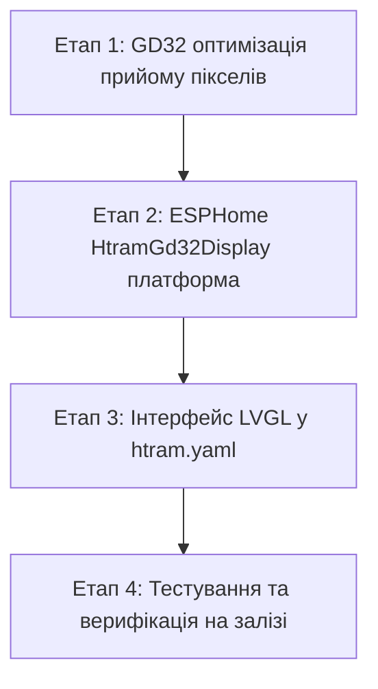

# План реалізації §4: Дисплей (канал DRAW_RECT / UI від ESP32 через LVGL)

## 1. Резюме архітектурного дослідження та обмежень

### 1.1. Апаратна частина (GD32F150C8T6 @ 72 МГц)
1. **Інтерфейс ST7789:** 
   - Матриця 240 × 240 RGB565 (115 200 байтів на повний кадр).
   - Підключення: `PB12` (RES), `PB13` (SCK), `PB14` (CS), `PB15` (SDA), `PB8` (Backlight).
   - **3-wire 9-bit SPI:** апаратний SPI модуль GD32F150 підтримує лише 8/16-бітні кадри (згідно з *GD32F1x0 User Manual §23.3.1*). Через відсутність окремого піна D/C заводська прошивка використовує **бітбенг по GPIO**.
   - **Швидкість бітбенгу на 72 МГц:** 1 піксель = 18 тактів (~250–350 нс). Заливка повного екрана займає всього **~15–20 мс** (>50 FPS), тому бітбенг **не є вузьким місцем**.
2. **Міжпроцесорний лінк UART:**
   - Фізично з'єднані тільки 2 лінії: `PA2` (TX) та `PA3` (RX). Ліній апаратного flow-control (**RTS/CTS**) немає.
   - **Швидкість:** Попередня спроба переходу на 921 600 бод призвела до втрати зв'язку (через несумісність із завантажувачем або переповнення 256-байтного буфера).
   - **Безпечна стратегія:** Розпочинаємо на **115 200 бод**. Розрахунок показує, що для нашої моделі (оновлення телеметрії раз на 30 с, годинника раз на хвилину) швидкості 115 200 бод вистачає з величезним запасом завдяки **брудним прямокутникам** (передача годинника займає ~170 мс, оновлення цифр CO₂ ~800 мс раз на 30 с). Повний лінк залишається 100% сумісним із робочим OTA-завантажувачем.
3. **Пам'ять GD32:**
   - Вільна SRAM: **~7 КБ**. Поточний `rx_ring` становить лише 256 байтів. Розширюємо його до **2048 байтів**, що повністю усуває ризик переповнення під час прийому прямокутників.

### 1.2. Обчислювальна частина (ESP32-WROOM-32E)
1. **Пам'ять:** Вільна DRAM становить **~130 КБ**. 
   - Повний фреймбуфер 115 КБ в DRAM виділяти **не можна** (загроза нестачі пам'яті під Wi-Fi стек та TLS).
   - LVGL використовуватиме частковий буфер відмальовки (partial draw buffer) розміром $240 \times 20$ пікселів (**9.6 КБ**), що займає менше 8% вільної RAM.
2. **Рушій LVGL у ESPHome:**
   - LVGL самостійно відстежує брудні зони (dirty areas) і викликає `draw_pixels_at(x, y, w, h, ptr)` виключно для тих пікселів, що реально змінилися.

---

## 2. Поетапний план реалізації



---

### Етап 1: Оптимізація GD32 під потік пікселів
1. **Збільшення RX буфера:**
   - У [`firmware/gd32/src/protocol_engine.c`](file:///home/max/pet/ha-htram/firmware/gd32/src/protocol_engine.c) збільшити `RX_RING_SIZE` з 256 до `2048`.
2. **Оптимізація виливання пікселів у `display.c`:**
   - Додати функції пакетного стрімінгу: `display_start_pixels()` (опускає CS в LOW), `display_send_pixel_stream()` (жене біти пікселя без смикання CS), `display_end_pixels()` (піднімає CS в HIGH).
   - У `protocol_engine.c` під час обробки `CMD_TYPE_DRAW_RECT`: викликати `display_start_pixels()` на початку прямокутника та `display_end_pixels()` наприкінці. Це прискорить заливку на ~30%.
3. **Плавна передача керування екраном від GD32 до ESP32:**
   - У [`firmware/gd32/src/main.c`](file:///home/max/pet/ha-htram/firmware/gd32/src/main.c) при старті показувати стартовий екран ("HTRAM / SENSORS ONLINE").
   - Додати прапорець `g_external_display_active`: щойно від ESP32 приходить перший пакет `CMD_DRAW_RECT`, GD32 повністю припиняє своє локальне малювання екрана і передає контроль ESP32.

---

### Етап 2: ESPHome Display платформа (`htram_gd32`)
1. **Створення платформи дисплея:**
   - Створити `esphome/custom_components/htram_gd32/display.py` та клас `HtramGd32Display` (нащадок `esphome::display::Display`).
   - Реалізувати метод `draw_pixels_at(int x, int y, int w, int h, const uint8_t *ptr, ...)`:
     - Пакує прямокутник у кадр `CMD_DRAW_RECT`:
       `[0xAA 0x55] [0x10] [X] [Y] [W] [H] [Length LE] [RGB565 Data...] [CRC16]`
     - Шле пакет по `uart_id`.
     - Якщо область перевищує безпечний чанк (наприклад, >8 КБ), автоматично розбиває її на горизонтальні смуги.
2. **Підключення у конфігурацію:**
   - Зареєструвати `display` у `htram.yaml`:
     ```yaml
     display:
       - platform: htram_gd32
         id: htram_display
     ```

---

### Етап 3: Створення сучасного інтерфейсу на LVGL
1. **Конфігурація LVGL у `htram.yaml`:**
   ```yaml
   lvgl:
     displays:
       - htram_display
     buffer_size: 4800  # 240 * 20 px = 9.6 KB
     bg_color: 0x000000  # True Black
   ```
2. **Компонування круглої матриці 240×240:**
   - **Верхній статусний сектор (y: 12..35):**
     - Поточний час (`time.homeassistant`, формат `HH:MM`).
     - Іконка Wi-Fi із рівнем сигналу.
     - Іконка батареї та відсоток заряду.
   - **Центральний сектор CO₂ (y: 45..125):**
     - Велике число CO₂ шрифтом Roboto 48–56 px.
     - Адаптивний динамічний колір:
       - `< 800 ppm` → Смарагдовий зелений (`#00E676`)
       - `800 .. 1200 ppm` → Теплий бурштиновий (`#FFD600`)
       - `> 1200 ppm` → Рубіновий червоний (`#FF1744`)
     - Підпис дрібним шрифтом: `ppm CO₂`.
   - **Середній фоновий сектор (y: 115..175):**
     - LVGL Chart (Area chart) з історією CO₂ за останні 2–4 години з градієнтним спаданням у чорне тло.
   - **Нижній сектор мікроклімату та погоди (y: 180..220):**
     - Температура та вологість із вбудованого SHT30 (`24.5 °C`, `55 %`).
     - Вулична температура або значок погоди з Home Assistant (за наявності сутності).

---

### Етап 4: Верифікація та тестування
1. Компіляція та заливка тестового оновлення GD32 (збільшений буфер + `display_send_pixel_stream`).
2. Компіляція та OTA-заливка ESPHome з новим компонентом дисплея.
3. Перевірка:
   - Відсутність артефактів та розривів кадрів на ST7789.
   - Миттєве оновлення годинника (<0.2 с) без затримок.
   - Плавний перехід кольорів числа CO₂ при зміні порогів.
   - Стабільна робота телеметрії та кнопок паралельно з графікою.

---

## 3. Файли для модифікації та створення

1. `[MODIFY]` [`firmware/gd32/src/protocol_engine.c`](file:///home/max/pet/ha-htram/firmware/gd32/src/protocol_engine.c) — `RX_RING_SIZE` до 2048, стрімінг CS у `STATE_PIXELS`.
2. `[MODIFY]` [`firmware/gd32/src/display.c`](file:///home/max/pet/ha-htram/firmware/gd32/src/display.c) та [`display.h`](file:///home/max/pet/ha-htram/firmware/gd32/inc/display.h) — функції `display_start_pixels()`, `display_send_pixel_stream()`, `display_end_pixels()`.
3. `[MODIFY]` [`firmware/gd32/src/main.c`](file:///home/max/pet/ha-htram/firmware/gd32/src/main.c) — передача контролю дисплея при надходженні `CMD_DRAW_RECT`.
4. `[NEW]` `esphome/custom_components/htram_gd32/display.py` — реєстрація платформи `display` в ESPHome.
5. `[MODIFY]` [`esphome/custom_components/htram_gd32/htram_gd32.h`](file:///home/max/pet/ha-htram/esphome/custom_components/htram_gd32/htram_gd32.h) та [`htram_gd32.cpp`](file:///home/max/pet/ha-htram/esphome/custom_components/htram_gd32/htram_gd32.cpp) — метод `send_draw_rect(...)` та клас `HtramGd32Display`.
6. `[MODIFY]` [`esphome/htram.yaml`](file:///home/max/pet/ha-htram/esphome/htram.yaml) — конфігурація `display`, шрифти, `time`, віджети `lvgl`.
